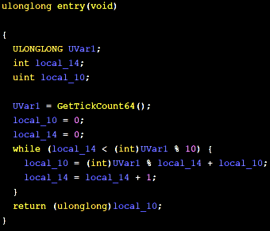
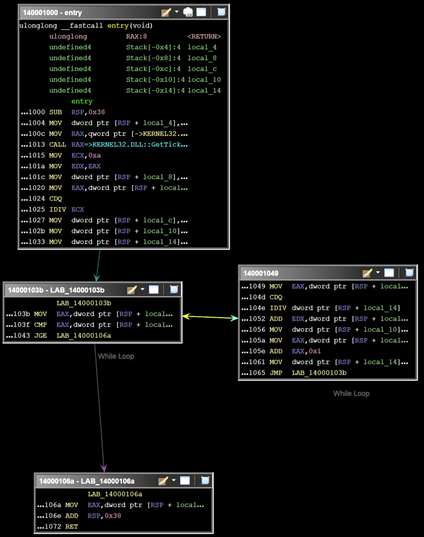
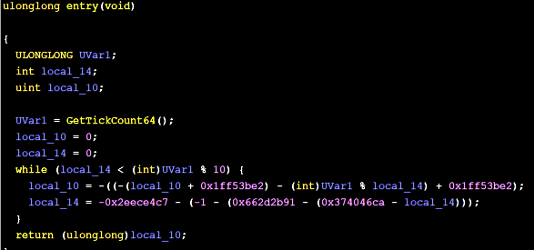
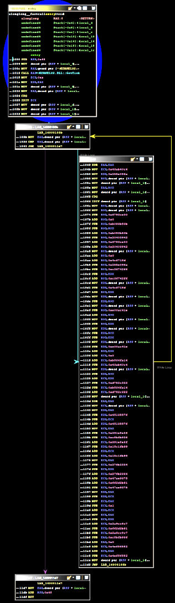
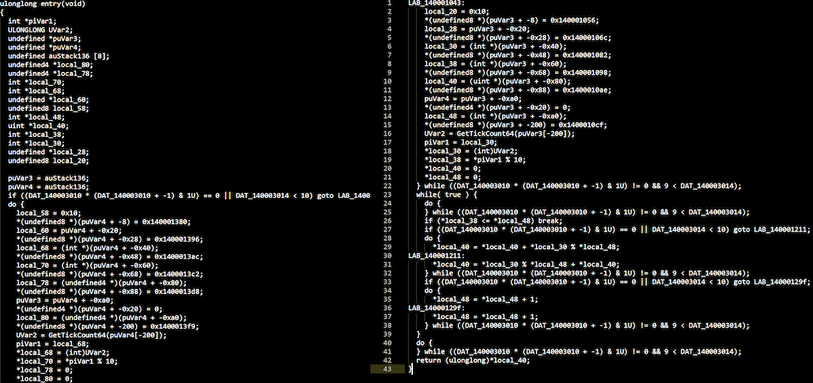
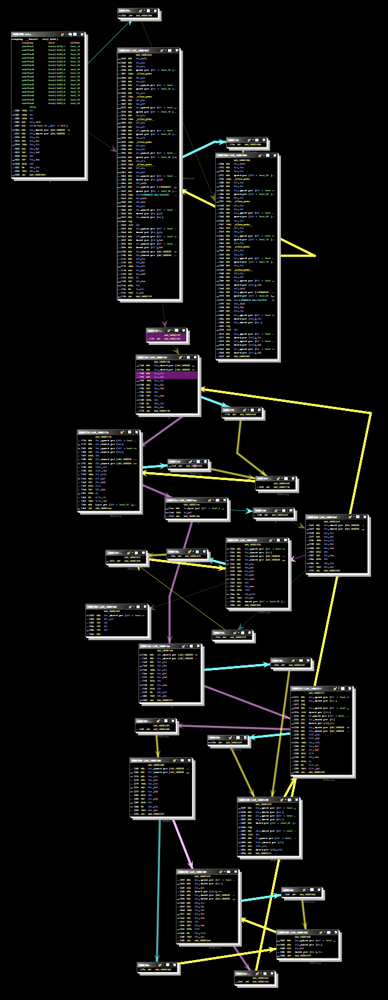
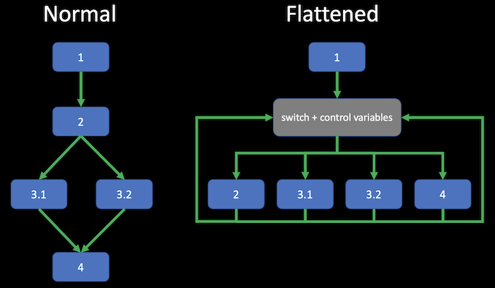
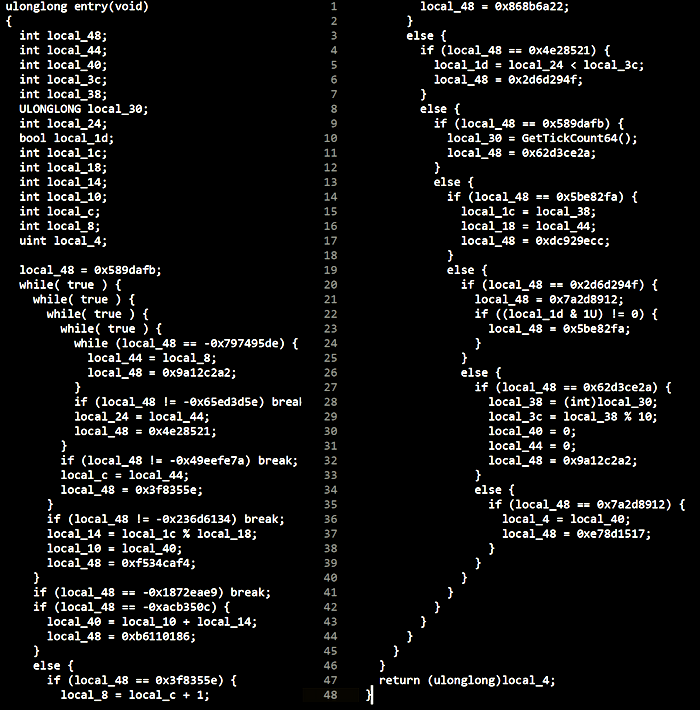
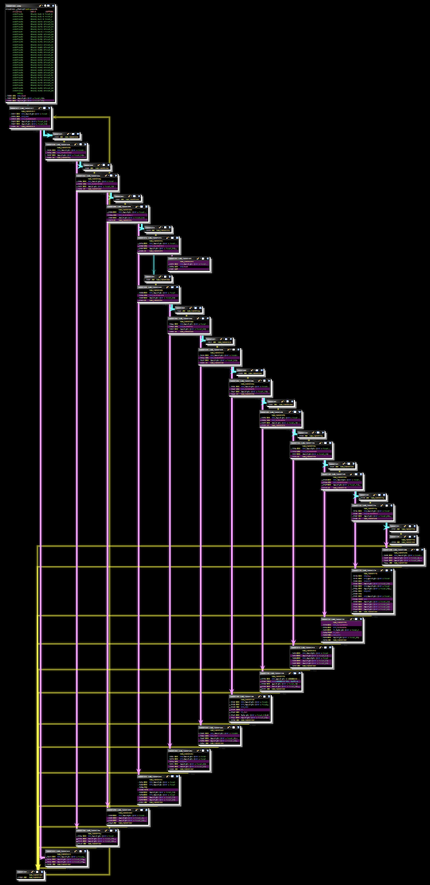

## Introduction
This is the sixth post of a series which regards the development of malicious software. In this series we will explore and try to implement multiple techniques used by malicious applications to execute code, hide from defenses and persist.  
Today we will explore anti-disassembly obfuscation using LLVM and template metaprogramming.

## LLVM obfuscation
LLVM is a compiler infrastructure. To understand what it is exactly we need to dive into compilation process (this is most accurate for unmanaged code like C/C++).

We can distinguish three steps of assembly generation from the source code:
1. Front end, which includes:  
	* scanner, which performs lexical analysis of the code and produces tokens (strings with certain meaning)
	* parser, which produces an abstract syntax tree (tokens grouped in a tree which represents the actual algorithm implemented in the source code)
	* semantic analysis (mainly type checking), during which the AST is checked for errors like wrong use of types or use of variables before initialization
	* generation of intermediate representation, usually based on AST
2. Optimization, which aims at reducing code complexity for example by precalculating stuff. Optimization must not change the algorithm/program itself.
3. Back end, which translates the intermediate representation to expected output (assembly or bytecode).

The core of LLVM is the optimizer but the project also includes a compiler front end - `clang` - which is intended to be used with the LLVM toolchain.

### Obfuscator-LLVM
We will leverage [`Obfuscator-LLVM`](https://github.com/obfuscator-llvm/obfuscator) project which is an open-source fork of the LLVM.

Obfuscation works on the mentioned intermediate representation (IR) level. In other words it's a kind of 'anti'-optimization. `Clang` is used to generate IR from source code, then the IR is processed to obfuscate code flow and finally the assembly is generated.

### Setup
Having gone through the theoretical introduction, let's prepare the environment for C++ code obfuscation. The Obfuscator-LLVM needs to be downloaded and compiled. The latest branch is `llvm-4.0` (from 2017, the latest version of LLVM is `11.0` nowadays) and the code needs to be compiled with Visual Studio 2017 and not 2019 (as it gives some errors during compilation). We need to use `CMake` to generate VS2017 project and then compile it (minding the target architecture). We can use `Developer Command Prompt for VS 2017` which is a part of Visual Studio 2017:

```bat
git clone -b llvm-4.0 https://github.com/obfuscator-llvm/obfuscator
cd obfuscator
mkdir build
cd build
cmake -G "Visual Studio 15 2017 Win64" ..
```

Note: I had to manually define `ENDIAN_LITTLE` identifier to get rid of some compilation errors. 

There are different ways to use `Obfuscator-LLVM` compiler:
* use manually via command line 
* add the compiler as a *custom build tool* for `.cpp` and other files in Visual Studio (in a relevant file *Property Pages*)
* use VS Installer to install a `clang-cl` platform toolset and manually swap Visual Studio's clang version with the compiled compiler [(this kinda sounds like a chicken-egg problem :))](https://en.wikipedia.org/wiki/Bootstrapping_(compilers))

### Usage and features
Let's write a simple program which performs some rather simple calculations based on a pseudorandom value:

```c
int main()
{
	int a = GetTickCount64();
	int b = a % 10;
	int c = 0;
	for (int i = 0; i < b; i++)
	{
		c += a % i;
	}
	return c;
}
```

Note: I compiled this code without `CRT` dependency so the binary is small and there's no additional code (like `mainCRTStartup` etc.) - see part 4 of malware development series.

This is how the code looks like after decompiling with Ghidra:



And the program graph:



`Obfuscator-LLVM` has 3 code obfuscation features: instructions substitution, bogus control flow and control flow flattening. Let's explore them. Details can be found [in the project's repository](https://github.com/obfuscator-llvm/obfuscator/wiki/Features)

These features use random value which has to be provided as a command line parameter (`-mllvm -aesSeed=1234567890ABCDEF1234567890ABCDEF`) on Windows systems (on Linux it uses `/dev/random`).

#### Instructions substitution
This replaces simple arithmetic operations with more complex but equivalent ones. For example: `a = b + c` may be changed to `r = rand(); a = b + r; a = a + c; a = a - r;`. The random value is calculated during the compilation.

It's possible to apply substitutions multiple times. Random seed from the command line is used to randomly select substitute instruction sequence so this brings some additional uniqueness to the resulting binary.

Let's add following switches to the compilation command line: `-mllvm -sub -mllvm -sub_loop=5 -mllvm -aesSeed=1234567890ABCDEF1234567890ABCDEF`

Resulting assembly (decompiled):



And the graph:



Note here that the Ghidra decompiler handled obfuscator 'deoptimizations' quite well.

#### Bogus control flow
This adds opaque predicates before instruction blocks. An opaque predicate is basically a portion of (prefably random) code which is evaluated at the runtime to a predetermined logical value (`true` or `false`). It is followed by a conditional jump which points to an original instruction block.

This obfuscation can also be applied multiple times, and can target random blocks of code.

Example usage: `-mllvm -bcf -mllvm -bcf_prob=100 -mllvm -bcf_loop=1 -mllvm -aesSeed=1234567890ABCDEF1234567890ABCDEF`

Resulting assembly (decompiled):



And the graph:



#### Control flow flattening
This one disrupts the sequence of instructions block by placing them on the same level in a looped `switch` statement. Additional variables are defined which actually control the order of execution. See the diagram below - it should make this more clear:



This obfuscation can also be applied multiple times on.a single block.

Example usage: `-mllvm -fla -mllvm -split -mllvm -aesSeed=1234567890ABCDEF1234567890ABCDEF`

Resulting assembly (decompiled):



And the graph:



### Testing
Now let's compile and obfuscate some simple malware. Remember the simplest shellcode injector from the part 1 of the series? LLVM obfuscation won't do much with it because the most obvious indicators (shellcode and imports) will be still present and intact.

Thst's why we will test another code - for example [this classic reverse shell](https://github.com/sh3llc0d3r1337/windows_reverse_shell_1/blob/master/ReverseShell.cpp). Actually this uses the same method as the `shell_reverse_tcp` shellcode (create an IP socket and create cmd process with its standard streams attached to the socket).

Interestingly, uploading compiled binaries to VirusTotal resulted in only one detection for the code compiled without obfuscation and 6 detections when multiple obfuscation methods were applied.

### Conclusion
`Obfuscator-LLVM` is a great resource to learn and understand what actually happens during the code compilation and how can this process be modified to make static assembly analysis more difficult and time-consuming. However it's important to remember that the IR-level obfuscation can be reversed (not completely, but still). See [this great article](https://blog.quarkslab.com/deobfuscation-recovering-an-ollvm-protected-program.html) for an example of the deobfuscation process.

Here are some general thoughts and considerations: From an offensive penetration tester perspective, it's important to combine multiple layers of code protection measures to minimize chances of detection and hinder manual analysis as much as possible (well, with a reasonable ammount of our efforts). This helps to deliver effective adversary emulations focused on the actual objectives. Of course more advanced malware requires more work put into it by defensive teams, which is also a good thing.

Anyway, make sure to consider implementing some intermediate representation level obfuscation into your offensive tooling build process.

### Other LLVM-based obfuscators
Also be sure to check other LLVM-based obfuscators and articles on building custom obfuscators with LLVM:

[https://github.com/HikariObfuscator/Hikari/](https://github.com/HikariObfuscator/Hikari/)

[https://medium.com/@polarply/build-your-first-llvm-obfuscator-80d16583392b](https://medium.com/@polarply/build-your-first-llvm-obfuscator-80d16583392b)

[http://www.babush.me/dumbo-llvm-based-dumb-obfuscator.html](http://www.babush.me/dumbo-llvm-based-dumb-obfuscator.html)

[https://github.com/emc2314/YANSOllvm](https://github.com/emc2314/YANSOllvm)

[https://blog.scrt.ch/2020/06/19/engineering-antivirus-evasion/](https://blog.scrt.ch/2020/06/19/engineering-antivirus-evasion/)

[https://blog.scrt.ch/2020/07/15/engineering-antivirus-evasion-part-ii/](https://blog.scrt.ch/2020/07/15/engineering-antivirus-evasion-part-ii/)

## Template metaprogramming
Before diving into the details of C++ constructs like templates, constant expressions and metaprogramming, let's consider a simple case: we have a source code with some string literals (like IP addresses, domain names etc.) that need to be obfuscated so they are invisible in the assembly and only revealed at runtime. Easiest thing to do here is to encrypt these literals and replace them with a call to decryption routine, for example:

```c
const char* address = "www.example.com";
```

replaced with:

```c
char* Decrypt(const char* data);
(...)
char* addr = Decrypt("xxx.yyyyyyy.zzz");
```

Of course we would have to consider string length, null-byte terminators etc.

We would prefer to use plaintext values in the source code and obfuscate/encrypt them automatically during the build process. Replacement of plain strings with encrypted ones can be automated with a pre-build task, e.g. some Python script. But there's another, cooler way to do this.
### Introduction
Let's get familiar with some features introduced in `C++11` standard: `template`s and `constexpr`essions. The following won't cover all the details of metaprogramming concepts - it's just a simple introduction which will help to understand how obfuscation based on template metaprogramming actually work.
#### Templates
Templates are functions that operate on generic types. Templates allow simple creation of functions which operate on multiple types (basic types, structs, classes). For example we can use the following template:

```c
template <typename T>
bool Equal(T arg1, T arg2)
{
	return (arg1 == arg2)
}
```

instead of defining overloaded functions:

```c
bool Equal(int arg1, int arg2);
bool Equal(double arg1, double arg2);
```

And example template usage:

```c
Equal <int>(1, 2));
```

Of course types must implement `==` operator in order to use the `Equal` function template.

Templates can be also used to create a generic struct or class, which then can be instantiated to be used with a specific type:

```c
template <typename T>
struct Stack
{
	void push(T* object);
	T* pop();
};

Stack<Fruit> fruitStack;
Stack<Vegetable> vegetableStack;
```

This also provides type safety, in this case you won't be able to mix fruits with vegetables - `fruitStack.push(new Vegetable());` will produce a compilation error.

Let's see an another example - usage of template for recursive factorial calculation:

```c
template <int N>
struct Factorial
{
	enum { value = N * Factorial<N - 1>::value };
};

template <>
struct Factorial<0>
{
	enum { value = 1 };
};

Factorial<5>::value // 5! = 120
```

We see here that an integer can be a template argument and that a template **specialization** (`template <>`) is needed to define a value for a specific argument.

#### Constant expressions
The `constexpr` specifier indicates that the value of some expression can be evaluated at compile time. For example, when such a constant expression defined:

```c
constexpr int sum(int a, int b)
{
	return (a + b);
}
```

`Sum(1+2)` will be precalculated at compile time - this calculation won't consume resources at the application's runtime.

#### Metaprogramming
Metaprogramming is just modifying programs by other programs or by themselves. Turns out that templates are a kind of functional programming language and can be used by compiler to generate source code.

Remember? It's exactly what we were doing with pre-build scripts - creating a temporary source code with sensitive data obfuscated.

### String obfuscation
Having understood the ability to write code which can be executed by compilers, let's create a simple string obfuscator which will replace plaintext data with XORed values just before compilation. We would like to use the obfuscation in the following manner: `Obfuscated("secret");`. The `Obfuscated` macro should replace the `"secret"` with a decryption function with an encrypted argument: `Decrypt_runtime(Encrypt_compiletime(secret))`.

To use constant string at compile time, we need to know its exact length. So we will need a compile time function which operates on this length value. So first, we need to create a template which will get an integer as an argument: `template <unsigned int N>`.

Now we will create a struct which holds the obfuscated string (which will replace the plaintext in the source code) and has a compile time function (`constexpr`) as a constructor to obfuscate the plaintext:

```c
struct Obfuscator
{
	char data[N] = { 0 };
	constexpr Obfuscator(const char* plaintext)
	{
		for (int i = 0; i < N; i++)
		{
			data[i] = plaintext[i] ^ 0x00;
		}
	}
}
```

Now we obfuscate data in source code by creating an `Obfuscator<7>` struct from the `Obfuscator<N>` template (7 = string length + null byte):

```c
constexpr Obfuscator<7> obfuscated = Obfuscator<7>("secret");
```

To actually use the data in the application we need to decrypt it, so we add deobfuscation function (which operates on a constant value, hence the `const` identifier following its declaration) to the `Obfuscator` template:

```c
const char* Deobfuscate() const
{
	char plaintext[N] = { 0 };
	for (int i = 0; i < N; i++)
	{
		plaintext[i] = data[i] ^ 0x11;
	}
	return plaintext;
}
```

Now we can deobfuscate the `obfuscated` constant variable: `obfuscated.Deobfuscate()`.

The last thing to do is to create a helper macro which simplifies the obfuscation in the source code. We will use another goodie of `C++11` - lambda functions:

```c
#define Obfuscated(string) []() -> const char* \
{ \
	constexpr auto secret = Obfuscator<sizeof(string) / sizeof(string[0])>(string); \
	return secret.Deobfuscate(); \
}()
```

Thanks to this string literals appearing in the binary are XOR encrypted. It's possible to enhance this method to make the application create stack based strings which won't appear in the `.text` section of PE file.

### Other possibilities
It's possible to implement quite advanced string and code obfuscation using template metaprogramming. For more detailed explanation see [this awesome workpaper](https://www.blackhat.com/docs/eu-14/materials/eu-14-Andrivet-C-plus-plus11-Metaprogramming-Applied-To-software-Obfuscation-wp.pdf) by Sebastien Andrivet and his [ADVobfuscator tool](https://github.com/andrivet/ADVobfuscator) which implements described concepts. There is a number of such obfuscators available and the best thing about them is that we can use them by just adding header files to the project:

[https://github.com/fritzone/obfy](https://github.com/fritzone/obfy)

[https://github.com/revsic/cpp-obfuscator](https://github.com/revsic/cpp-obfuscator)

## Summary
This post was just an introduction to advanced and powerful obfuscation methods which leverage LLVM compiler infrastructure and template metaprogramming.

Next time we will talk about keyloggers and implement one.
