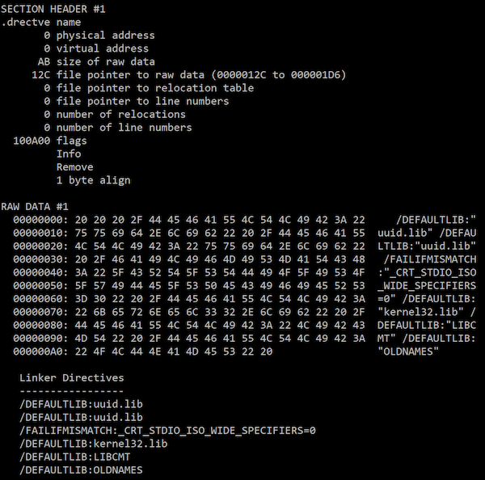
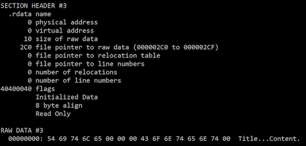
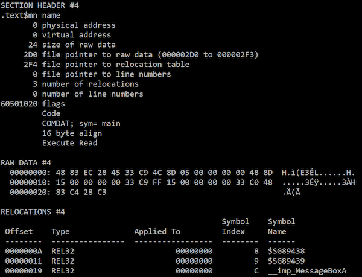
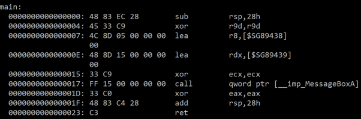
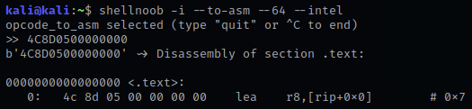
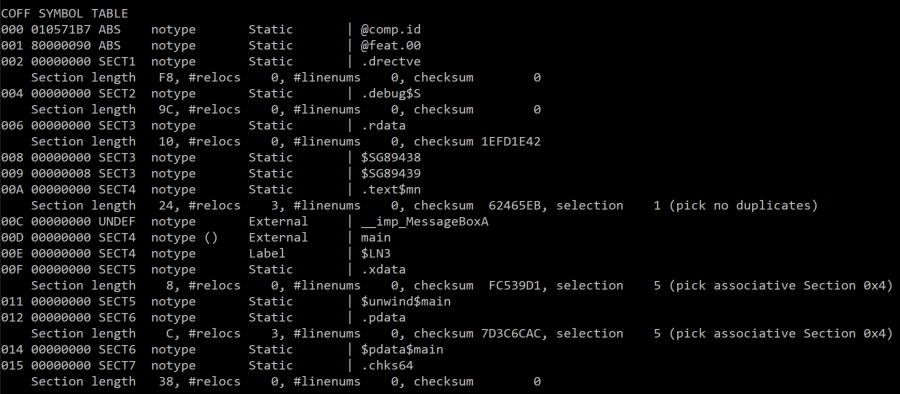
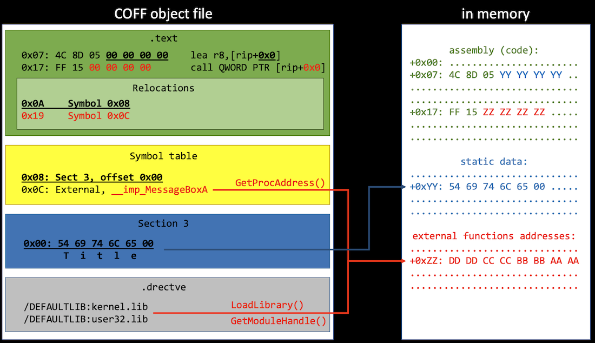

## Introduction
This is the eigth post of a series which regards the development of malicious software. In this series we will explore and try to implement multiple techniques used by malicious applications to execute code, hide from defenses and persist.  
This time we will implement a COFF object file loader, which is similar to [BOF (beacon object file) feature of Cobalt Strike](https://www.cobaltstrike.com/help-beacon-object-files). This has been also tackled by [TrustedSec](https://www.trustedsec.com/blog/coffloader-building-your-own-in-memory-loader-or-how-to-run-bofs/).

The code is in [my GitHub repo](https://github.com/0xpat/COFFInjector).

Note: We are working with 64-bit code here.
## C code compilation
Generating an executable from C/C++ source code is a three-step process:
1. Preprocessing - interpretation of precompiler directives (merging `#include`d files, replacing `#define`d identifiers). Precompiler basically replaces text in the source code to produce a translation unit.
2. Compilation (at which we took a detailed look in part 6). Compiler generates assembly from source code and creates an object file.
3. Linking - combining object files and needed libraries into the final executable (which can also be a DLL).

An executable can be either natively executed by OS loader or injected into memory (for example via process hollowing or any other applicable technique).

But what if we could execute object files? Actually this is possible, since these files contain the actual machine code we're interesed in.

## COFF object files
Common Object File Format is a executable code format originating from Unix. Microsoft created their own variant of COFF and PE format based on that. [Microsoft documentation] contains a miture of information regarding COFF and PE file formats.

Object files produced by Visual Studio compiler use COFF format. Such an object file (with `.obj` extension) contains:
* header (with architecture information, timestamp, number of sections and symbols and others),
* sections (with assembly, debug information, linker directives, exceptions information, static data etc.),
* symbols (like functions and variables) table with information about their location.

Sections may contain relocation information which specifies how section data should be modified by linker and then during loading into memory. For example `.text` section with assembly has information specifying what parts of code should be replaced and what should they reference in memory. More on that later.

We need to browse the COFF file contents and extract assembly along with relocation data and perform relocations. The final code (with relocations applied) can be executed by just calling it as a function (`((void(*)())(code))()`) or with  (for example with `CreateThread`).

### Example object file
Let's consider a very simple console application:

```c
int main()
{
	MessageBoxA(NULL, "Content", "Title", NULL);
	return 0;
}
```

`MessageBoxA` function is located in `user32.dll` - we need to hint the linker about that.

> Normally, `.lib` files are static libraries containing code (actually object files) that can be statically linked to an executable. However with dynamic linking linker uses special `.lib` files which point to relevant dynamic libraries - this information is used by linker to build the Import Address Table of an executable.

This can be done either by changing the project options in Visual Studio or using the following directive:

`#pragma comment(lib, "user32.lib")`

> I disabled compiler optimization (`/Od`) for this piece of code. Enabling optimization resulted in different data arrangement in the object file and caused problems with my PoC COFF loader. Further testing would be required.

Compilation using MSVC compiler (`cl.exe`) produces an object file (with `.obj` extension). We can analyze its content using `dumpbin` tool shipped with MSVC. Let's see some of the tool's output.

#### Directives (`.drectve` section)
Here are linker directives, most importantly information on which libraries should be browsed for external functions.



#### Read-only data (`.rdata` section)
This is statically initialized data, for example string literals.



#### Executable code (`.text` section)
This is the actual assembly. In my example this section has been named `.text$mn` by the MSVC compiler.



This is where things get more interesting, let's disassemble the code:



We see here how `MessageBoxA` arguments (int 0, char* "Content", char* "Title", int 0) are passed according to the [x64 calling convention](https://docs.microsoft.com/en-us/cpp/build/x64-calling-convention). 

Let's take a look at the third instruction (located at offset `0x07`. When disassembled using for example [ShellNoob](https://github.com/reyammer/shellnoob) the instruction uses `0x00000000` offset:



So how does the `dumpbin` disassembler knows that function should reference a symbol? That's where relocations come into play. Below the `.text` section raw data we can see relocation information. For example, first relocation table entry says that `0x00000000` bytes at offset `0x0A` (which is the second operand of `lea` instruction) should be replaced with actual (relative to `RIP`) address of symbol no. 8.

The same goes for the `call` instruction at offset `0x17` along with respective relocation entry and symbol. However here relocation concerns relative function address address. That's right - relative address (`call` operand) gets dereferenced and the value stored there (actual `MessageBoxA` address) is called.

When the code gets loaded into system memory, loader parses relocation data and puts functions and data addresses in right places. However this happens during PE executable loading. We want to load the COFF object file, so we need to analyze it and perform in-memory relocations. 
#### Symbol table
This table contains symbols such as static variables or external functions.



The symbol table is [a bit tricky to read and understand](https://docs.microsoft.com/en-us/windows/win32/debug/pe-format#coff-symbol-table). However usually the `Value` field indicates the offset of the symbol within the section (described by `SectionNumber` field).

Also, to know where one symbol data ends, we need to check the offset of the next one in the same section or total section size.

## The object file loader
To inject and execute a simple COFF file we need to read the `.text` section and fill all zeros with relative addresses of external functions and static data (i.e. relocate symbols referenced in this section). Of course we also need to place these symbols somewhere in memory, for example after the assembly.

To find external functions we will need to browse libraries indicated in linker directives. We can use `LoadLibrary`/`GetModuleHandle`/`GetProcAddress` functions or for example browse PEB and `InMemoryOrderModuleList` (see part 4).

The diagram below illustrates this concept:



I used [COFFI](https://github.com/serge1/COFFI) library for parsing COFF files. This is a great header-only C++ library which has all functions I needed to read stuff from the object files. COFFI uses some of C++ Standard Library data structures like strings, vectors etc., and so does my code.

My algorithm goes like this:
1. Get pointers to `.text` section and relocations, directives, static data and symbol table. 
2.  Calculate memory needed for assembly + static data + external function pointers (by iterating all `.text` relocations). 
3. Copy assembly to RW(X) memory. 
4. Copy static symbols right after the code (each symbol size is calculated by checking offset of the next one in a given section). 
5. While copying static symbols perform relocations (replace zeros in the assembly with relative addresses). 
6. Resolve all static functions by looking in libraries referenced in linker directives (`LoadLibrary` but `dll` not `lib` files), place addresses in the memory (right after static data; use `GetProcAddress`) and perform relocations. WinAPI function names are prefixed with `__imp_` in the COFF symbol table. 
7. Call the assembly start location (make sure the memory is executable - use `VirtualProtect` if necessary).

### Defining additional APIs
Cobalt Strike's BOF implement a set of functions which can be called from the injected object file code (aka Beacon API). We can do it, too.

The object file loaded can have an internal function defined, for example:

```c
void COFF_API_Print(char* string)
{
	printf(string);
}
```

and added as an import to the object file code:

`__declspec(dllimport) void COFF_API_Print(char* string);`

It then has to be processed like WinAPI imports during loading.

### Returning a value
When calling the injected `main` function from an object file, we can access the returned value from the caller:

`int returnedValue = ((int(*)())code)();`
### Caveats
* This PoC code assumes that the object file contains only single function (`main`) and won't work if there are other subroutines.
* The object file is compiled without C Runtime and there are no runtime initialization funcitons - `main` is the entry point. Also, code optimizations by compiler are disabled.

## Summary
We've gained understanding of COFF object file format produced by MSVC compiler. Since these files contain all information needed to execute the code, they may be as well injected and executed in memory, delivered for example over a C&C channel. This is a powerful technique that surely poses a challenge to malicious code detection capabilities.

The code is in [my GitHub repo](https://github.com/0xpat/COFFInjector).
