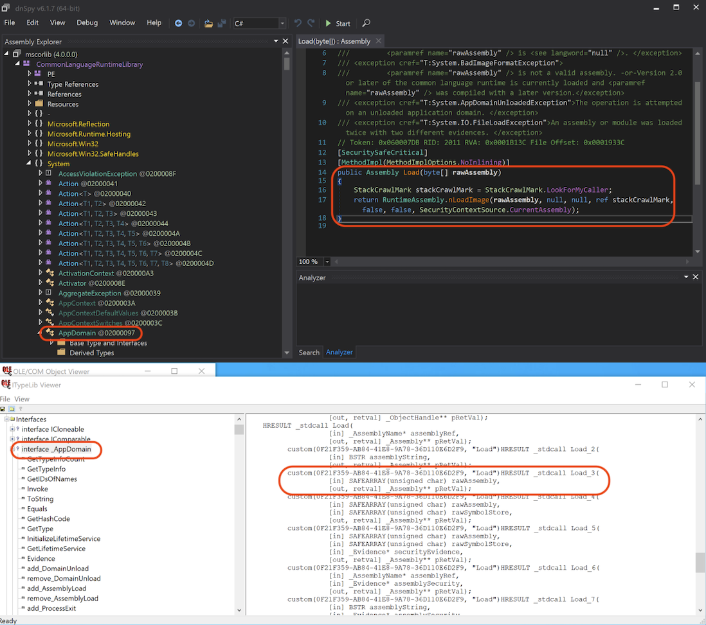

## Introduction
This is the 9th post of a series which regards the development of malicious software. In this series we will explore and try to implement multiple techniques used by malicious applications to execute code, hide from defenses and persist.  
Today we explore techniques for executing managed code from a native code.

Note: We are working with 64-bit code here, as usual.
## Unmanaged vs managed code
Unmanaged (native) code is compiled directly to assembly which is interpreted by a processor. Managed code is compiled to some intermediate representation (bytecode) which is interpreted by a runtime. The runtime can also manage memory, collect garbage etc.

Generally it's easier to develop apps using managed languages like Java or .NET because developer doesn't need to bother with memory allocation, freeing and other low-level stuff. Runtime provides abstraction from these low-level operations and system API, sometimes even allowing cross-platform development (e.g. .NET Core).

However sometimes developers can benefit from direct integration with operating system's API and memory offered by native languages (like C/C++). And most importantly (from malware developer's perspective) - native code is more difficult to reverse engineer and offers more possibilities for obfuscation.

## .NET runtime hosting
Managed assembly (executable or DLL) when loaded via `CreateProcess` or `LoadLibrary` is interpreted by Windows loader and the loading routine initializes the CLR (Common Language Runtime). In a PE file there's a `COM Descriptor Directory` which contains .NET metadata and its presence indicates the very fact that the PE contains managed code.

However it is possible to manually host the CLR from a native application using [CLR Hosting interfaces](https://docs.microsoft.com/en-us/dotnet/framework/unmanaged-api/hosting/clr-hosting-interfaces).

`mscoree.dll` implements functions that we can use for CLR hosting. There is `ICLRRuntimeHost` interface which can be used to start the CLR runtime and execute an assembly from disk. The code is as simple as:

```c
ICLRMetaHost* metaHost = NULL;
CLRCreateInstance(CLSID_CLRMetaHost, IID_ICLRMetaHost, (LPVOID*)&metaHost);
ICLRRuntimeInfo* runtimeInfo = NULL;
metaHost->GetRuntime(L"v4.0.30319", IID_ICLRRuntimeInfo, (LPVOID*)&runtimeInfo);
ICLRRuntimeHost* runtimeHost = NULL;
runtimeInfo->GetInterface(CLSID_CLRRuntimeHost, IID_ICLRRuntimeHost, (LPVOID*)&runtimeHost);
runtimeHost->Start();
DWORD retVal;
CLRRuntimeHost->ExecuteInDefaultAppDomain(L"path_to_assembly", L"Namespace.Class", L"MethodName", L"argument", &retVal);
```

According to [documentation](https://docs.microsoft.com/en-us/dotnet/framework/unmanaged-api/hosting/iclrruntimehost-executeindefaultappdomain-method) the managed method to execute must have the following signature:

```c#
static int pwzMethodName (String pwzArgument)
```

## Executing .NET code in memory
However it is not that simple to execute a managed assembly stored for example as a byte array in memory. To do this we must refer to a deprecated `ICorRuntimeHost` interface. It allows more control over the managed runtime from the native code.

So instead of `CLRRuntimeHost` we want `CorRuntimeHost` and that's what we ask for using [`ICLRRuntimeInfo::GetInterface`](https://docs.microsoft.com/en-us/dotnet/framework/unmanaged-api/hosting/iclrruntimeinfo-getinterface-method):

```c
ICorRuntimeHost* corRuntimeHost = NULL;
runtimeInfo->GetInterface(CLSID_CorRuntimeHost, IID_ICorRuntimeHost, (LPVOID*)&corRuntimeHost);
```

To execute a managed assembly in memory we will use managed methods and some reflection:

```c#
Assembly managedAssembly = AppDomain.CurrentDomain.Load(assemblyByteArray);
Type managedType = managedAssembly.GetType("Namespace.Class");
object[] parameters = new object[1] {("Argument_1")};
managedType.InvokeMember("MethodName", BindingFlags.Public | BindingFlags.InvokeMethod | BindingFlags.Static, null, null, parameters);
```

But how to execute this managed code from an unmanaged CLR host? We will leverage Component Object Model.

It is possible to [expose .NET components to COM](https://docs.microsoft.com/en-us/dotnet/framework/interop/exposing-dotnet-components-to-com).

.NET framework system assemblies are compiled with COM interoperability enabled, so it's possible to call public methods from "outside" of the CLR.

To start, we need an unmanaged reference (pointer) to an AppDomain. Application domains are containters that provide isolation boundary within single runtime host. That's where `CorRuntimeHost` interface comes in handy - it allows to retrieve the default AppDomain for current process:

```c
IUnknown* appDomainThunk;
pCorRuntimeHost->GetDefaultDomain(&appDomainThunk);
_AppDomain* defaultAppDomain = NULL;
appDomainThunk->QueryInterface(&defaultAppDomain);
```
At this point we can rewrite the .NET code using C++ and COM.

### Accessing mscorlib from C++ using COM
All the code we need is located in `mscorlib.dll` which is a managed library of common .NET types and methods.

First of all we need to somehow "translate" the COM interfaces defined in `mscorlib` library to a format understood by C++ compiler, like a header defining external function names, signatures and types (so imports, memory offsets, stack alignment for function calls etc.).

There is a [Type Library Exporter](https://docs.microsoft.com/en-us/dotnet/framework/tools/tlbexp-exe-type-library-exporter) tool (`tlbexp.exe`) which we can use to create a type library from a managed assembly. Type library files should be present after Visual Studio and .NET workload installation but let's create and analyze them manually:

`tlbexp.exe mscorlib.dll`

`.tlb` file can be viewed with OLE-COM Object Viewer (`oleview.exe`, part of Visual C++ SDK)

Let's take a look at the .NET code for in-memory assembly loading:

```c#
Assembly managedAssembly = AppDomain.CurrentDomain.Load(assemblyByteArray);
```

In our case, `CurrentDomain` is the `_AppDomain* defaultAppDomain` pointer. So we need to find a `Load(byte[])` function exported as COM interface.



We can see that separate COM interface function is declared for every overload of `AppDomain.Load` method. We specifically target the overload which uses byte array storing the raw assembly as only parameter. So `Assembly AppDomain.Load(byte[] rawAssembly)` becomes `HRESULT _stdcall Load_3([in] SAFEARRAY(unsigned char) rawAssembly, [out, retval] _Assembly** pRetVal);`.  Values are returned by reference using the last parameter.

Another thing is that we can't just provide an unmanaged byte array to this function, we need to create a [SAFEARRAY](https://docs.microsoft.com/en-us/archive/msdn-magazine/2017/march/introducing-the-safearray-data-structure). This is another piece of complicated COM/OLE automation. Note: `VT_UI1` used in `SafeArrayCreate` is `VARTYPE` corresponding to `unsigned char`/`byte` array.

```c
SAFEARRAYBOUND bounds[1];
bounds[0].cElements = sizeof (rawAssemblyByteArray);
bounds[0].lLbound = 0;
SAFEARRAY* safeArray = SafeArrayCreate(VT_UI1, 1, bounds);
SafeArrayLock(safeArray);
memcpy(safeArray->pvData, rawAssemblyByteArray, sizeof (rawAssemblyByteArray));
SafeArrayUnlock(safeArray);
_AssemblyPtr managedAssembly = NULL;
```

Finally, load the assembly to the AppDomain:

```c
defaultAppDomain->Load_3(safeArray, &managedAssembly)
```

Next step is to get reference to a type defined in the assembly. This line:

```c#
Type managedType = managedAssembly.GetType("Namespace.Class");
```

translates to:

```c
_TypePtr managedType = NULL;
_bstr_t managedClassName("ManagedApp.Program");
managedAssembly->GetType_2(managedClassName, &managedType);
```

Now let's create an array of arguments. So to do this:

```c#
object[] parameters = new object[1] {("Argument_1")};
```

we need to use `SAFEARRAY` again with `VARTYPE` corresponding to [`VARIANT`](https://docs.microsoft.com/en-us/windows/win32/winauto/variant-structure) which is another COM/OLE-specific data structure used for example to hold strings:

```c
SAFEARRAY* managedArguments = SafeArrayCreateVector(VT_VARIANT, 0, 1);
_variant_t argument(L"Argument_1");
LONG index = 0;
SafeArrayPutElement(managedArguments, &index, &argument);
```

Last thing is to call a function by its name:

```c#
managedType.InvokeMember("EntryPoint", BindingFlags.Public | BindingFlags.InvokeMethod | BindingFlags.Static, null, null, parameters);
```

```c
_bstr_t managedMethodName(L"EntryPoint");
_variant_t managedReturnValue;
_variant_t empty;
managedType->InvokeMember_3(
	managedMethodName,
	static_cast<BindingFlags>(BindingFlags_InvokeMethod | BindingFlags_Static | BindingFlags_Public),
	NULL, empty, managedArguments, &managedReturnValue);
```

## Summary
The piece of code I described for loading .NET assembly purely in memory has been known for many years but I couldn't find any good explanation on how it works. Hopefully somebody finds this interesting.

I've also spent some time on trying to use `ICLRRuntimeHost` instead of deprecated `ICorRuntimeHost` but I couldn't find an easy and elegant way to execute assembly in memory, especially to retrieve a pointer to an `AppDomain`. It seems to me that only possible solution would be to load some small assembly which would return a unmanaged pointer to a managed function using `GetFunctionPointerForDelegate` and then call it using [`ICLRRuntimeHost::ExecuteInAppDomain` method](https://docs.microsoft.com/en-us/dotnet/framework/unmanaged-api/hosting/iclrruntimehost-executeinappdomain-method) which isn't well documented at all. Anyway, [here's an example on stackoverflow.com](https://stackoverflow.com/questions/40643018/clr-injected-net-code-crashes-on-file-access) which I haven't checked.

One more thing: remember to patch AMSI if you're injecting some "malicious" assembly because `AppDomain.Load(byte[])` (or `_AppDomain::Load_3()`) uses AMSI to scan the binary for indicators of malicious intents. See [this piece of .NET runtime source code](https://github.com/dotnet/runtime/blob/main/src/coreclr/vm/peimagelayout.cpp#L347) for details.
